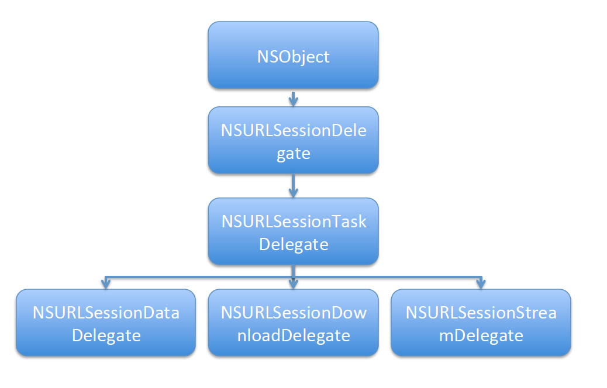

## NSURLSession

- NSURLSession在2013年随着iOS7的发布一起面世，苹果对它的定位是作为NSURLConnection的替代者，然后逐步将NSURLConnection退出历史舞台。现在使用最广泛的第三方网络框架：AFNetworking、SDWebImage等等都使用了NSURLSession。
- Session翻译为中文意思是回话，在网络协议中有物理层 -> 数据链路层 -> 网络层  -> 传输层 -> `回话层` -> 表示层 -> 应用层，可以将NSURLSession类理解为回话层，用于管理网络接口的创建、维护、删除等等工作，我们要做的工作也只是回话层之后的层即可，底层的工作NSURLSession已经帮我们封装好了。


- 另外还有一些Session，比如AVAudioSession用于音频访问，WCSession用于WatchOS通讯，他们都是建立一个会话，并管理会话，封装一些底层。

其核心就是对网络任务进行封装，实现多线程。比如将一个网络请求交给NSURLSession，最后NSURLSession将访问结果通过block回调返回，期间自动实现多线程，而且可以用个代理实现监听（是否成功，当前的进度等等）；大致分为3个步骤

#### 1 NSURL：请求地址，定义一个网络资源路径：

```objective-c
NSURL *url = [NSURL URLWithString:@"协议://主机地址/路径?参数&参数"];
```

解释如下：

- **协议**：不同的协议，代表着不同的资源查找方式、资源传输方式，比如常用的http，ftp等
- **主机地址**：存放资源的主机的IP地址（域名）
- **路径**：资源在主机中的具体位置
- **参数**：参数可有可无，也可以多个。如果带参数的话，用“?”号后面接参数，多个参数的话之间用&隔开

#### 2 **NSURLRequest**：请求，根据前面的NSURL建立一个请求：

```objective-c
NSURLRequest *request = [NSURLRequest requestWithURL:url cachePolicy:NSURLRequestUseProtocolCachePolicy timeoutInterval:30.0];
```

参数解释如下：

- **url**：资源路径
- **cachePolicy**：缓存策略（无论使用哪种缓存策略，都会在本地缓存数据），类型为美剧类型，取值如下：

```objective-c
    *   NSURLRequestUseProtocolCachePolicy = 0 //默认的缓存策略，使用协议的缓存策略
    *   NSURLRequestReloadIgnoringLocalCacheData = 1 //每次都从网络加载
    *   NSURLRequestReturnCacheDataElseLoad = 2 //返回缓存否则加载，**很少使用**
    *   NSURLRequestReturnCacheDataDontLoad = 3 //只返回缓存，没有也不加载，**很少使用**
```

- timeoutInterval：超长时间，默认60s，这是设置为30s

  另外，还可以设置其他一些信息，比如请求头，请求体等等

  注意，下面的request应为NSMutableURLRequest，即可变类型

```objective-c
// 告诉服务器数据为json类型
[request setValue:@"application/json" forHTTPHeaderField:@"Content-Type"]; // 设置请求体(json类型)
NSData *jsonData = [NSJSONSerialization dataWithJSONObject:@{@"userid":@"123456"} options:NSJSONWritingPrettyPrinted error:nil];
request.HTTPBody = jsonData; 
```

#### 3 **NSURLSession**：创建NSURLSession发送请求

- 为了方便使用，苹果提供了一个全局的NSURLSession单利，如同NSURLConnection一样。这样做的缺陷就是不能监控，如果想要监控每一个请求，则必须通过代理来监听，我们知道单利是一对多的，而代理是一对一，因此必须自己实例化单独的Session任务对象（NSURLConnection则很难），来实现单例监控。
- 系统一共提供了5种任务类，继承关系如下图所示。其中NSURLSessionTask为抽象类，不能实现网络访问，NSURLSessionStreanTask（以流的方式进行网络访问）使用的比较少，使用的多的是dataTask、downloadTask、uploadTask，基本满足了网络的基本需求：获取数据（通常是JSON、XML等）、文件上传、文件下载。这三个类都是NSURLSessionionTask这个抽象类的子类，相比直接使用NSURLConnection、NSURLSessionTask支持任务的暂停、取消和回复，并且默认任务运行在其他非主线程中。
- 根据图中代理协议的名字不难发现，每一人任务类都有相对应的代理协议，只有NSURLSessionUploadTask没有对应的代理协议，因为NSURLSessionUploadTask集成自NSURLSessionDataTask，因此NSURLSessionDataDelegate即为NSURLSessionUploadTask对应的代理协议。




#### 举例

#### 1.NSURLSession请求网络数据

苹果提供的全局NSURLSession单例为例。

```objective-c
/// 向网络请求数据
- (void)NSURLSessionTest {
    // 1.创建url
    // 请求一个网页
    NSString *urlString = @"http://www.cnblogs.com/mddblog/p/5215453.html";

// 一些特殊字符编码
    urlString = [urlString stringByAddingPercentEncodingWithAllowedCharacters:[NSCharacterSet URLQueryAllowedCharacterSet]];
    NSURL *url = [NSURL URLWithString:urlString];
    
    // 2.创建请求 并：设置缓存策略为每次都从网络加载 超时时间30秒
    NSURLRequest *request = [NSURLRequest requestWithURL:url cachePolicy:NSURLRequestReloadIgnoringLocalCacheData timeoutInterval:30];

    // 3.采用苹果提供的共享session
    NSURLSession *sharedSession = [NSURLSession sharedSession];
    
    // 4.由系统直接返回一个dataTask任务
    NSURLSessionDataTask *dataTask = [sharedSession dataTaskWithRequest:request completionHandler:^(NSData * _Nullable data, NSURLResponse * _Nullable response, NSError * _Nullable error) {
        // 网络请求完成之后就会执行，NSURLSession自动实现多线程
        NSLog(@"%@",[NSThread currentThread]);
        if (data && (error == nil)) {
            // 网络访问成功
            NSLog(@"data=%@",[[NSString alloc] initWithData:data encoding:NSUTF8StringEncoding]);
        } else {
            // 网络访问失败
            NSLog(@"error=%@",error);
        }
    }];
    
    // 5.每一个任务默认都是挂起的，需要调用 resume 方法
    [dataTask resume];
}
```

#### 2.NSURLSession文件下载

```objective-c
/// 文件下载
- (void)NSURLSessionDownloadTaskTest { // 1.创建url
  NSString *urlString = [NSString stringWithFormat:@"http://localhost/周杰伦 - 枫.mp3"]; // 一些特殊字符编码
  urlString = [urlString stringByAddingPercentEncodingWithAllowedCharacters:[NSCharacterSet URLQueryAllowedCharacterSet]];
  NSURL *url = [NSURL URLWithString:urlString]; // 2.创建请求
  NSURLRequest *request = [NSURLRequest requestWithURL:url]; // 3.创建会话，采用苹果提供全局的共享session
  NSURLSession *sharedSession = [NSURLSession sharedSession]; // 4.创建任务
  NSURLSessionDownloadTask *downloadTask = [sharedSession downloadTaskWithRequest:request completionHandler:^(NSURL * _Nullable location, NSURLResponse * _Nullable response, NSError * _Nullable error) { if (error == nil) { // location:下载任务完成之后,文件存储的位置，这个路径默认是在tmp文件夹下! // 只会临时保存，因此需要将其另存
          NSLog(@"location:%@",location.path); // 采用模拟器测试，为了方便将其下载到Mac桌面 // NSString *filePath = [NSSearchPathForDirectoriesInDomains(NSCachesDirectory, NSUserDomainMask, YES) lastObject];
          NSString *filePath = @"/Users/userName/Desktop/周杰伦 - 枫.mp3";
          NSError *fileError;
          [[NSFileManager defaultManager] copyItemAtPath:location.path toPath:filePath error:&fileError]; if (fileError == nil) {
              NSLog(@"file save success");
          } else {
              NSLog(@"file save error: %@",fileError);
          }
      } else {
          NSLog(@"download error:%@",error);
      }
  }]; // 5.开启任务
[downloadTask resume];
}
```

#### 3.NSURLSession文件上传

**3.1 采用uploadTask任务，以数据流的方式进行上传**

这种方式好处就是大小不受限制，上传需要服务器端脚本支持，脚本源代码**见本文档最后的附录**，客户端示例代码如下：

```objective-c
/// 以流的方式上传，大小理论上不受限制，但应注意时间
- (void) NSURLSessionBinaryUploadTaskTest { // 1.创建url  采用Apache本地服务器
    NSString *urlString = @"http://localhost/upload.php"; urlString = [urlString stringByAddingPercentEncodingWithAllowedCharacters:[NSCharacterSet URLFragmentAllowedCharacterSet]];
    NSURL *url = [NSURL URLWithString:urlString]; // 2.创建请求
    NSMutableURLRequest *request = [NSMutableURLRequest requestWithURL:url]; // 文件上传使用post
    request.HTTPMethod = @"POST"; // 3.开始上传   request的body data将被忽略，而由fromData提供
    [[[NSURLSession sharedSession] uploadTaskWithRequest:request fromData:[NSData dataWithContentsOfFile:@"/Users/userName/Desktop/IMG_0359.jpg"]     completionHandler:^(NSData * _Nullable data, NSURLResponse * _Nullable response, NSError * _Nullable error) { if (error == nil) {
            NSLog(@"upload success：%@",[[NSString alloc] initWithData:data encoding:NSUTF8StringEncoding]);
        } else {
            NSLog(@"upload error:%@",error);
        }
    }] resume];
}
```

**3.2 采用dataTask任务，拼接表单的方式进行上传**

- 上传的关键是请求体部分的表单拼接，获取本地上传文件的类型（MIME Types），至于具体的网络上传则很简单。另外拼接表单的方式会有大小限制，即HTML的MAX_FILE_SIZE限制（可以自己设定，一般2MB）。
- 根据上面的继承关系图，我们知道uploadTask是dataTask的子类，也可以使用uploadTask来代替dataTask。在代码示例中4.2步骤完全可以替换4.1步骤。这时uploadTaskWithRequest函数fromData可有可无，文件已在request里面包含。

> 注意：**然而在苹果官方对uploadTaskWithRequest函数的介绍：`request的body data in this request object are ignored`，会被忽略，而测试时发现没有被忽略，且request必须包含HTTPBody，反而fromData被忽略。那么暂时理解为苹果对uploadTaskWithRequest函数的使用时没有考虑拼接表单的方式，那么当我们使用拼接表单时，建议不要使用uploadTask，虽然这样也能成功**

- 服务器端用到的upload.php源代码**见本文最后的附录**

表单拼接格式如下，boundary作为分界线：

```c
--boundary
Content-Disposition:form-data;name=”表单控件名称”;filename=”上传文件名称”
Content-Type:要上传文件MIME Types

要上传文件二进制数据; --boundary--
```

拼接表单示例代码：

```objective-c
/// 文件上传
- (void)NSURLSessionUploadTaskTest { // 1.创建url  采用Apache本地服务器
    NSString *urlString = @"http://localhost/upload/upload.php";
    urlString = [urlString stringByAddingPercentEncodingWithAllowedCharacters:[NSCharacterSet URLFragmentAllowedCharacterSet]];
    NSURL *url = [NSURL URLWithString:urlString]; // 2.创建请求
    NSMutableURLRequest *request = [NSMutableURLRequest requestWithURL:url]; // 文件上传使用post
    request.HTTPMethod = @"POST";
    NSString *contentType = [NSString stringWithFormat:@"multipart/form-data; boundary=%@",@"boundary"];
    [request setValue:contentType forHTTPHeaderField:@"Content-Type"]; // 3.拼接表单，大小受MAX_FILE_SIZE限制(2MB)  FilePath:要上传的本地文件路径  formName:表单控件名称，应于服务器一致
    NSData* data = [self getHttpBodyWithFilePath:@"/Users/userName/Desktop/IMG_0359.jpg" formName:@"file" reName:@"newName.png"];
    request.HTTPBody = data; // 根据需要是否提供，非必须,如果不提供，session会自动计算
    [request setValue:[NSString stringWithFormat:@"%lu",data.length] forHTTPHeaderField:@"Content-Length"]; // 4.1 使用dataTask
    [[[NSURLSession sharedSession] dataTaskWithRequest:request completionHandler:^(NSData * _Nullable data, NSURLResponse * _Nullable response, NSError * _Nullable error) { if (error == nil) {
            NSLog(@"upload success：%@",[[NSString alloc] initWithData:data encoding:NSUTF8StringEncoding]);
        } else {
            NSLog(@"upload error:%@",error);
        }

    }] resume]; #if 0
    // 4.2 开始上传 使用uploadTask   fromData:可有可无，会被忽略
    [[[NSURLSession sharedSession] uploadTaskWithRequest:request fromData:nil     completionHandler:^(NSData * _Nullable data, NSURLResponse * _Nullable response, NSError * _Nullable error) { if (error == nil) {
            NSLog(@"upload success：%@",[[NSString alloc] initWithData:data encoding:NSUTF8StringEncoding]);
        } else {
            NSLog(@"upload error:%@",error);
        }
    }] resume]; #endif } /// filePath:要上传的文件路径   formName：表单控件名称  reName：上传后文件名
- (NSData *)getHttpBodyWithFilePath:(NSString *)filePath formName:(NSString *)formName reName:(NSString *)reName
{
    NSMutableData *data = [NSMutableData data];
    NSURLResponse *response = [self getLocalFileResponse:filePath]; // 文件类型：MIMEType  文件的大小：expectedContentLength  文件名字：suggestedFilename
    NSString *fileType = response.MIMEType; // 如果没有传入上传后文件名称,采用本地文件名!
    if (reName == nil) {
        reName = response.suggestedFilename;
    } // 表单拼接
    NSMutableString *headerStrM =[NSMutableString string];
    [headerStrM appendFormat:@"--%@\r\n",@"boundary"]; // name：表单控件名称  filename：上传文件名
    [headerStrM appendFormat:@"Content-Disposition: form-data; name=%@; filename=%@\r\n",formName,reName];
    [headerStrM appendFormat:@"Content-Type: %@\r\n\r\n",fileType];
    [data appendData:[headerStrM dataUsingEncoding:NSUTF8StringEncoding]]; // 文件内容
    NSData *fileData = [NSData dataWithContentsOfFile:filePath];
    [data appendData:fileData];

    NSMutableString *footerStrM = [NSMutableString stringWithFormat:@"\r\n--%@--\r\n",@"boundary"];
    [data appendData:[footerStrM  dataUsingEncoding:NSUTF8StringEncoding]]; // NSLog(@"dataStr=%@",[[NSString alloc] initWithData:data encoding:NSUTF8StringEncoding]);
    return data;
} /// 获取响应，主要是文件类型和文件名
- (NSURLResponse *)getLocalFileResponse:(NSString *)urlString
{
    urlString = [urlString stringByAddingPercentEncodingWithAllowedCharacters:[NSCharacterSet URLFragmentAllowedCharacterSet]]; // 本地文件请求
    NSURL *url = [NSURL fileURLWithPath:urlString];
    NSURLRequest *request = [NSURLRequest requestWithURL:url];

    __block NSURLResponse *localResponse = nil; // 使用信号量实现NSURLSession同步请求
    dispatch_semaphore_t semaphore = dispatch_semaphore_create(0);
    [[[NSURLSession sharedSession] dataTaskWithRequest:request completionHandler:^(NSData * _Nullable data, NSURLResponse * _Nullable response, NSError * _Nullable error) {
        localResponse = response;
        dispatch_semaphore_signal(semaphore);
    }] resume];
    dispatch_semaphore_wait(semaphore, DISPATCH_TIME_FOREVER); return localResponse;
}
```

## 四 NSURLSessionConfiguration

NSURLConnection是全局性的，即它的配置对全局有效，如果有两个链接需要不同的cookies、证书这些公共资源，则NSURLConnection无法满足要求，这时NSURLSession的优势则体现出来，NSURLSession可以通过NSURLSessionConfiguration可以设置全局的网络访问属性

```objective-c
NSURLSessionConfiguration *config = [NSURLSessionConfiguration defaultSessionConfiguration]; // delegateQueue：请求完成回调函数和代理函数的运行线程，如果为nil则系统自动创建一个串行队列，不影响sessionTask的运行线程
NSURLSession *session = [NSURLSession sessionWithConfiguration:config delegate:self delegateQueue:[NSOperationQueue mainQueue]];
```

三种回话方式：

1. defaultSessionConfiguratin：进程内回话（默认会话），类似NSURLConnection的标准配置，用硬盘来缓存数据。
2. ephemeralSessionConfiguration：临时的进行会话（内存），不会将cookie、缓存储存到本地，只会放到内存中，当应用程序退出后数据也会消失，可以用于实现“密码浏览”
3. backgroundSessionConfiguration：建立后台会话可以在应用程序挂起，退出，崩溃的情况下运行上传和下载任务，后台另起一个线程。另外，系统会根据设备的负载程度决定分配下载的资源，因此有可能会很慢甚至超时失败。

设置一些网络属性：

- HTTPAdditionalHeaders：可以设置出站请求的数据头

```objective-c
configuration.HTTPAdditionalHeaders = @{ @"Accept": 
@"application/json", 
@"Accept-Language": 
@"en", 
@"Authorization": authString, 
@"User-Agent": userAgentString};
```

- networkServiceType，设置网络服务类型

  - NSURLNetworkServiceTypeDefault 默认

  - NSURLNetworkServiceTypeVoIP VoIP
  - NSURLNetworkServiceTypeVideo 视频
  - NSURLNetworkServiceTypeBackground 后台
  - NSURLNetworkServiceTypeVoice 语音

  allowsCellularAccess：允许蜂窝访问

  timeoutIntervalForRequest：请求的超时时长

  requestCachePolicy：缓存策略

  

  > 注意事项:如果是自定义会话并指定了代理，会话会对代理进行强引用,在视图控制器销毁之前，需要取消网络会话，否则会造成内存泄漏

  

  

  

  

   


