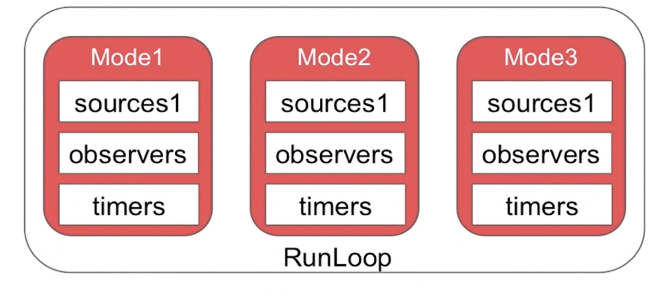

## RunLoop

- RunLoop概念
- RunLoop的数据结构
- RunLoop的Mode
- RunLoop的实现机制
- RunLoop与NSTimer
- RunLoop和线程

## 一、RunLoop概念

RunLoop是通过内部维护的事件循环（Event  Loop）来对<font color = #ff33>事件/消息进行管理</font>的一个对象。

1. 没有消息处理时，休眠已避免资源占用，由用户态切换到内核（CPU-内核态和用户态）
2. 有消息需要处理时，立即被唤醒，由内核态切换到用户态

##### 为什么main函数不会退出?

```objective-c
int main(int argc, char * argv[]) {
  @autoreleasepool {
    return UIApplicationMain(argc, argv, nil, NSStringFromClass([AppleDelegate class]));
  }
}
```

UIApplicationMain内部默认开启了主线程的RunLoop，并执行了一段无限循环的代码（不是简单的for循环或while循环）

```objective-c
// 无限循环代码模式（伪代码）
int main(int argc, char * argv[]) {
  BOOL running = YES;
  do {
    // 执行各种任务，处理各种事件
    // .......
  } while (running);
  
  return 0;
}
```

UIApplicationMain函数一直没有返回，而是不断地接受处理消息以及等待休眠，所以运行程序之后会保持续运行状态。

## 二、RunLoop的数据结构

NSRunLoop(Foundation) 是 CFRunLoop(CoreFoundation) 的封装，提供了面向对象的API

RunLoop 相关的主要涉及五个类

CFRunLoop：RunLoop对象

CFRunLoopMode：运行模式

CFRunLoopSource：输入源/事件源

CFRunLoopTimer：定时源

CFRunLoopObserver：观察者

##### 1、CFRunLoop

由pthread （线程对象，说明RunLoop和线程是一一对应的）、currentMode（当前所处的运行模式）、modes（多个运行模式的集合）、commonModes（模式名称字符串集合）、commonModeItems（Observer，Timer，Source集合）构成

##### 2、CFRunLoopMode

由name、source0、source1、observers、timers构成

##### 3、CFRunLoopSource

分为source0和source1两种

- source0:

  即非基于port的，也就是用户触发的事件。需要手动唤醒线程，将当前线程从内核切换到用户态。

- source1:

  基于port的，包含一个mach_port和一个回调，可监听系统端口和通过内核和其他线程发送的消息，能主动唤醒RunLoop，接收分发系统事件。

  具备唤醒线程的能力

##### 4、CFRunLoopTimer

基于事件的触发器，基本上说的就是NSTimer。在预设的时间点唤醒RunLoop执行回调。因为它是居于RunLoop的，因此它不是实时的（就是NSTimer是不准确的。因为RunLoop只负责分发源的消息。如果线程当前正在处理繁重的任务，就有可能导致Timer本次延时，或者少执行一次）。


##### 5、CFRunLoopObserver

监听以下时间点：CFRunLoopActivity

- kCFRunLoopEntry

  RunLoop准备启动

- kCFRunLoopBeforeTimers

  RunLoop将要处理一些Timer相关事件

- kCFRunLoopBeforeSources

  RunLoop将要处理一些Sources事件

- kCFRunLoopBeforeWaiting

  RunLoop将要进行休眠状态，即将由用户态切换到内核态

- kCFRunLoopAfterWaiting

  RunLoop被唤醒，即从内核态切换到用户态后

- kCFRunLoopExit

  RunLoop退出

- kCFRunLoopAllActivities

  监听所有状态

##### 6、各数据结构之间的联系

线程和RunLoop一一对应，RunLoop和Mode是一对多，Model和source、timer、observer也是一对多的


### 三、RunLoop的Mode

关于Mode首先要知道一个RunLoop对象中可能包含多个Mode，且每次调用RunLoop的主函数时，只能指定其中一个Mode（CurrentMode）。切换Mode，需要重新指定一个Mode。主要是为了分隔开不同的Source、Timer、Observer，让它们之间互不影响。



当RunLoop运行在Mode1上时，是无法接受处理Mode2或Mode3上的Source、Timer、Observer事件的

总共是有五种CFRunLoopMode：

- kCFRunLoopDefaultMode：默认模式，主线程是在这个运行模式下运行
- UITrackingRunLoopMode：跟踪用户交互事件（用于ScrollView追踪触摸滑动，保证界面滑动时不受其他Mode影响）
- UIInitializationRunLoopMode：在刚启动App时进入的第一个Mode，启动完成后就不再使用
- GSEventReceiveRunLoopMode：接受系统内部事件，通常用不到
- kCFRunLoopCommonModes：伪模式，不是一种真正的运行模式，是同步Sourece/Timer/Observer到多个Mode中的一种解决方案

### 四、RunLoop的实现机制


对于RunLoop而言最核心的事情就是保证在没有消息的时候休眠，在有消息时唤醒，以提高程序性能。RunLoop这个机制是依靠系统内核来完成（苹果操作系统核心组件Darwin中的Mach）。


RunLoop通过mach_msg() 函数接收、发送消息。它的本质是调用函数mach_msg_trap()，相当于是一个系统调用，会触发内核状态切换。在用户态调用mach_msg_trap() 时会切换到内核态；内核态中内核实现的mach_msg() 函数会完成实际的工作。

即基于port的source1，监听端口，端口有消息就会触发回调；而sorece0，要手动标记为待处理和手动唤醒RunLoop

Mach消息发送机制

大致逻辑为：

1. 通知观察者RunLoop即将启动
2. 通知观察者即将要处理Timer事件
3. 通知观察者即将要处理source0事件
4. 处理soruce0事件
5. 如果基于端口的源（source1）准备好并处于等待状态，进入步骤9。
6. 通知观察者线程即将进入休眠状态
7. 将线程置于休眠状态，由用户态切换到内核态，直到下面的任一事件发生才唤醒线程。

- 一个基于port 的 Source1 的事件（图里应该是source0）.
- 一个Timer到时间了
- RunLoop自身的超时间时间到了。
- 被其他调用者手动唤醒。

8. 通知观察者线程将被唤醒。
9. 处理唤醒时收到的事件。

- 如果用户定义的定时器启动，处理定时器时间并重启RunLoop。进入步骤2.
- 如果输入源启动，传递相应的消息。
- 如果RunLoop被显示唤醒而且时间还没超时，重启RunLoop。进入步骤2

10. 通知观察者RunLoop结束。

### 五、RunLoop与NSTimer

一个比较常见的问题：滑动tableView时，定时器还会生效吗？

默认情况下RunLoop运行在kCRunLoopDefaultMode下，而当滑动tableView时，RunLoop切换到UITrackingRunLoopMode，而Timder是在kCFRunLoopDefaultMode下的，就无法接受处理Timer的事件。

怎么去解决这个问题呢？把Timer添加到UITrackingRunLoopMode上并不能解决问题，因为这样在默认情况下就无法接受定时器事件了。

所以我们需要把Timer同时添加到UITrackingRunLoopMode和kCFRunLoopDefaultMode上。

那么如何把timer同时添加到多个mode上呢？就要用到NSRunLoopCommoonModes了

```objective-c
[[NSRunLoop currentRunLoop] addTimer:timer forMode:NSRunLoopCommonModes];
```

Timer就被添加到多个mode上，这样即使RunLoop由kCFRunLoopDefaulMode切换到UITrackingRunLoopMode下，也不会影响接收Timer事件

### 六、RunLoop和线程

- 线程和RunLoop是一一对应的，其映射关系是保存在一个全局的Dictionary里
- 自己创建的线程默认是没有开启RunLoop的

##### 1、怎么创建一个常驻线程？

1. 为当前线程开启一个RunLoop（第一次调用[NSRunLoop currentRunLoop]方法时实际是会先去创建一个 RunLoop）

2. 向当前RunLoop中添加一个Port/Source等维持RunLoop的事件循环（如果RunLoop的model中一个item都没有，RunLoop会退出）

3. 启动该RunLoop

   ```objective-c
   @autoreleasepool {
     NSRunLoop *runLoop = [NSRunLoop currentRunLoop];
     [[NSRunLoop currentRunLoop] addPort:[NSMachPort port] forMode: NSDefaultRunLoopMode];
     [runLoop run];
   }
   ```

   

   ##### 2、输出下边代码的执行顺序

   ```objective-c
   NSLog(@"1");
   dispatch_async(dispach_get_global_queue(0, 0)), ^{
     NSLog(@"2");
     [self performSelector:@selector(test) withObject:nil afterDelay: 10];
       NSLog(@"3");
   });
   
   NSLog(@"4");
   
   - (void)test {
     NSLog(@"5");
   }
   ```

   答案是1423，test方法并不会执行

   原因是如果带afterDelay的延时函数，会在内部创建一个NStimer, 然后添加到当前线程的RunLoop中。也就是如果当前线程没有开启RunLoop，该方法会失效。

   那改成：

   ```objective-c
   dispatch_async(dispatch_get_global_queue(0, 0), ^{
      NSLog(@"2");
   
     [[NSRunLoop currentRunLoop] run];
     [self performSelector: @selector(test) withObject:nil afterDelay: 10];
     
      NSLog(@"3");
   })
   ```

   然而test方法依然不执行。

   原因是如果RunLoop的mode中一个item都没有，RunLoop会退出。即在调用RunLoop的run方法后，由于其mode中没有添加任何item去维持RunLoop的时间循环，RunLoop随即还是会退出。所以我们自己启动RunLoop，一定要在添加item后

   ```
   dispatch_async(dispatch_get_global_queue(0, 0), ^{
      NSLog(@"2");
   
     [self performSelector: @selector(test) withObject:nil afterDelay: 10];
     [[NSRunLoop currentRunLoop] run];
   
      NSLog(@"3");
   })
   ```

   ##### 3、怎么保证子线程数据回来更新UI的时候不打断用户的滑动操作？

   当我们在子请求数据的同时滑动浏览当前页面，如果数据请求成功要切回主线程更新UI，那么就会影响当前正在滑动的体验。

   我们就可以将更新UI事件放在主线程的NSDefalutRunLoopMode上执行即可，这样就会等待用户不再滑动页面，主线程RunLoop由UITrackingRunLoopMode切换到NSDefaultRunLoopMode时再去更新UI

   ```objective-c
   [self performSelectorOnMainThread:@selector(reloadData) withObject:nil waitUntilDone:NO modes:@[NSDefaultRunLoopMode]];
   ```

   