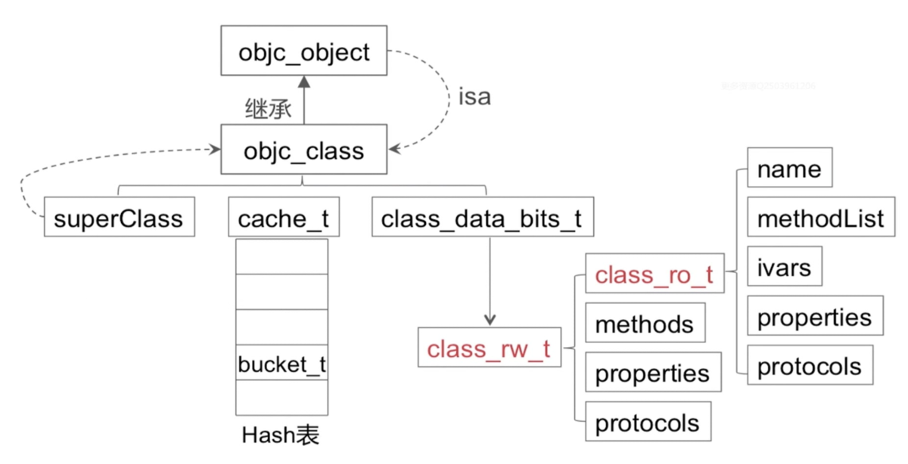
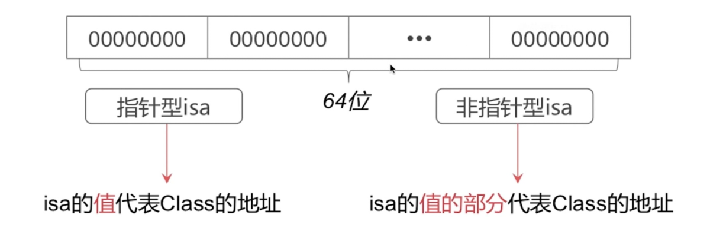
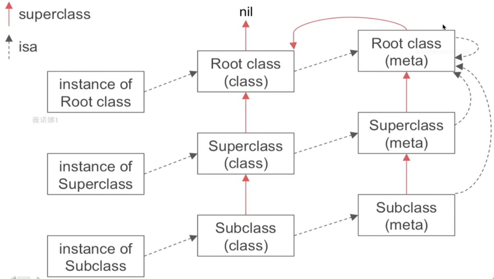
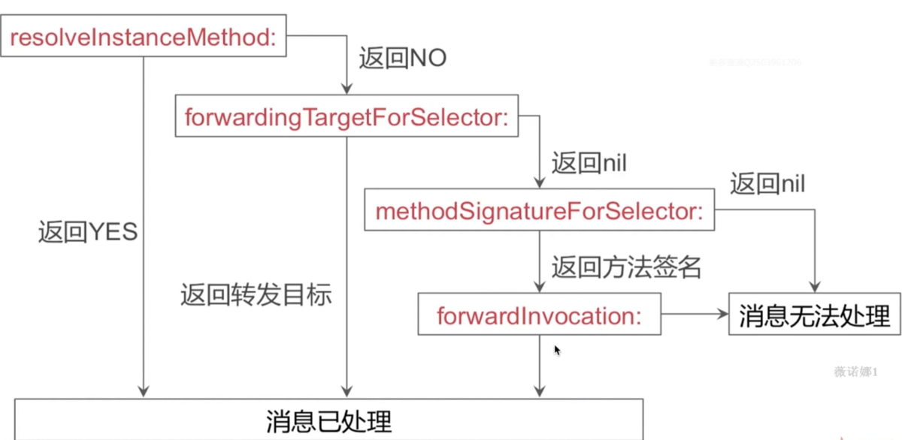

# runtime相关

- 数据结构：objc-object，objc_class，isa，class_data_bits_t，cache_t，method_t
- 对象，类对象，元对象
- 消息传递
- 消息转发

##### 一、数据结构：objc-object，objc_class，isa，class_data_bits_t，cache_t，method_t



- objc_object（id）

  isa_t，关于isa操作相关，弱引用相关，关联对象相关，内存管理相关

- objc_class（class）继承自objc_object

  Class  superClass，cache_t  cache，class_data_bits_t

- isa指针，共用体isa_t

  

- isa指向

  关于对象，其指向类对象

  关于类对象，其指向元类对象

  实例—（isa）—>class —(isa) —> MetaClass

- cache-t

  用于快速查找方法执行函数，是可增量扩展的哈希表结构，是局部性原理的最佳运用

```c
struct cache_t {
  struct bucket_t *_buckets; // 一个散列表，用来方法缓存, bucket_t类型，包括key以及方法实现IMP
  mast_t _mask; // 分配用来缓存bucket的总数
  mask_t _occupied; // 表明目前实际占用的缓存bucket的个数
}

struct bucket_t {
  private:
  cache_key_t _key;
  IMP _imp
}
```

- class_data_bits_t：对class_rw_t的封装

```c
struct class_rw_t {
  uint32_t flags;
  uint32_t version;
  
  const class_ro_t *ro;
  
  method_array_t methods;
  property_array_t properties;
  property_array_t protocols;
  
  Class firstSubclass;
  Class nextSiblingClass;
  
  char *demangledName;
}
```

Objc的类的属性、方法、以及遵循的协议都放在class_rw_t中，class_rw_t代表了类相关的读写信息，是对class_ro_t的封装，而class_ro_t代表了类的只读信息，存储了编译器决定了的属性、方法和遵守协议。

```c
struct class_ro_t {
  uint32_t flags;
  uint32_t instanceStart;
  uint32_t instanceSize;
  #ifdef __LP64__
  uint32_t reserved;
  #endif
  
  const uint8_t * ivarLayout;
  
  const char * name;
  method_list_t * baseMethodList;
  protocol_list_t * baseProtocols;
  const ivar_list_t * ivars;
  
  const uint8_t * weakIvarLayout;
  property_list_t *baseProperties;
  
  method_list_t *baseMethids() const {
    return baseMethodList;
  }
};
```

- method_t

  函数四要素：名称、返回值、参数、函数体

```c
struct method_t {
  SEL name;  // 名称
  const char *types; // 返回值和参数
  IMP imp;  // 函数体
}
```

##### 二、对象，类对象，元类对象

- 类对象存储实例方法列表等信息。
- 元类对象存储类方法列表等信息。



superClass是一层层集成的，到最后NSObject的superClass是nil，而NSObject的isa指向根元类，这个根元类的isa指向它自己，而它的superClass是NSObject,也就是最后形成一个环。

##### 三、消息传递

```c
void objc_msgSend(void /* id self, SEL op, ... */)
  
void objc_msgSendSuper(void /* struct objc_super *super, SEL op, ... */)
  
struct objc_super {
  /// Specifies an instance of a class
  __unsafe_unretained _Nonnull id receiver;
  
  /// Specified the particular superclass of the instance to message.
#if !defined(__cplusplus) && !__OBJC2__
  /* For compatibility with old objc-runtime.h header */
  __unsafe_unretained _Nonnull Class class;
#else
  __unsafe_unretained _Nonnull Class super_class;
#endif
  /* super_class is ther first class to search */
};
```

消息传递的流程：缓存查找—>当前类查找—>父类逐级查找

- 调用方法之前，先去查找缓存，看看缓存中是否有对应选择器的方法实现，如果有，就去调用函数，完成消息传递（缓存查找：给定值SEL，目标是查找对应bucket_t中的IMP，哈希查找）
- 如果缓存中没有，会根据当前实例的isa指针查找当前类对象的方法列表，看看是否有同样名称的方法，如果找到，就去调用函数，完成消息传递（当前类中查找：对于已排序好的方法列表，采用二分查找，对于没有排序好的列表，采用一般遍历）
- 如果当前类对象的方法列表没有，就会逐级父类方法列表中查找，如果找到，就去调用函数，完成消息传递（父类逐级查找：先判断父类是否为nil，为nil则结束，否则就继续进行缓存查找—>当前类查找—>父类逐级查找的流程）
- 如果一直查到根类依然没有查找到，则进入到消息转发流程中，完成消息传递。

##### 四、消息转发

```objective-c
+ (BOOL)resolveInstanceMethod:(SEL)sel; //为对象方法进行决议
+ (BOOL)resolveClassMethod:(SEL)sel; // 为类方法进行决议
- (id)forwardingTargetForSelector:(SEL)aSelector; // 方法转发目标
- (NSMethodSignature *)methodSignatureForSelector:(SEL)aSelector;
- (void)forwardInvocation:(NSInvocation *)anInvocation;
```



那么最后消息未处理的是还还会调用到- (void)doesNotRecognizeSelector:(SEL)aSelector这个方法，我们也可以在这个方法中做处理，避免crash，但是只建议在线上环境的时候做处理，实际开发过程中还是要把异常抛出来。

- 方法交换（Method_Swizzling）

```objective-c
+ (void)load {
  Method test = class_getInstanceMethod(self, @selector(test));
  Method otherTest = class_getInstanceMethod(self, @selector(otherTest));
  method_exchangeImplementations(test, otherTest);
}
```

应用场景：替换系统的方法，比如vierDidLoad，viewWillAppear以及一些响应方法，来进行统计信息

- 动态添加方法

```c
class_addMethod(self, sel, testImp, "v@:");

void testImp (void) {
  NSLog(@"testImp")
}
```

- @dynamic 动态方法解析

  动态运行时语言将函数决议推迟到运行时

  编译时语言在编译期进行函数决议

- [obj foo]和objc_msgSend()函数之间有什么关系？

  objc_msgSend()是[obj foo]的具体实现。在runtime中，onjc_msgSend()是一个c函数，[obj foo]会被翻译成这样的形式objc_msgSend(obj, foo).

- runtime是如果通过selector找到对应的IMP地址的？

  缓存查找—>当前类查找—>父类逐级查找

- 能否想编译后的类中增加实例变量？

  不能。编译后，该类已经完成了实例变量的布局，不能再增加实例变量。

  但可以向动态添加的累中增加实例变量。