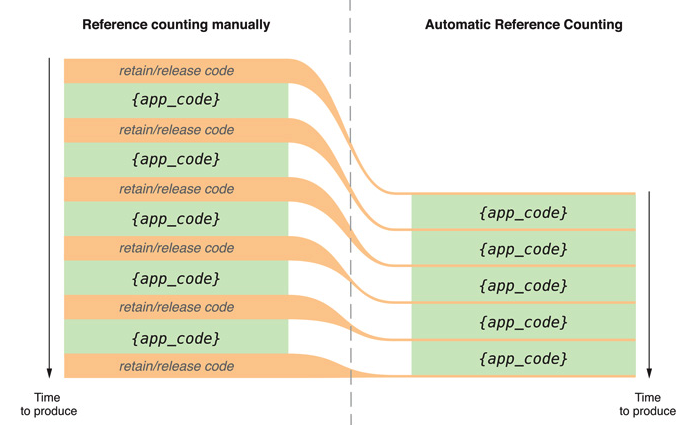
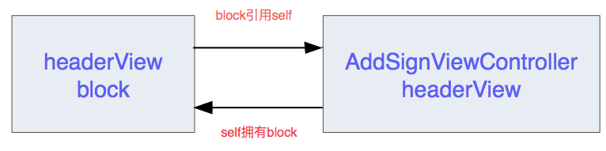
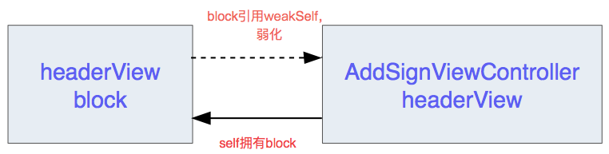
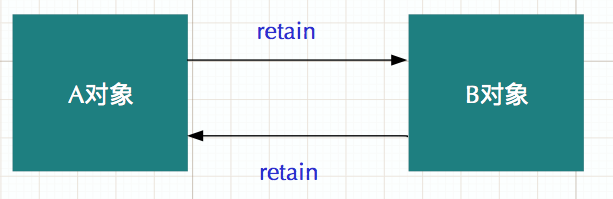
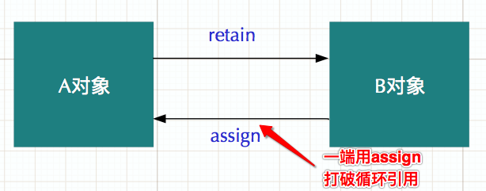

关键字相关

主要的属性修饰符有下面几种

- copy
- assign
- retain
- strong
- weak
- readwrite/readonly（读写策略、访问权限）
- nonatomic/atomic（安全策略）

如果以MRC和ARC进行区分修饰符使用情况，可以按照如下方式进行分组:

```objective-c
MAR: assign / retain / copy / readwrite 、 readonly / nonatomic 、 atomic 等。
ARC: assign / strong / weak / copy / readwrite 、 readonly / nonatomic 、 atomic 等。
```

属性修饰符对retainCount计数的影响。

1. alloc 为对象分配内存，reatainCount 为1.
2. retain MRC下 retainCount + 1.
3. copy一个对象变成新的对象，retainCount 为1，原有的对象计数不变。
4. release 对象的引用计数 - 1.
5. autorelease对象的引用计数 retainCount - 1，如果为0，等到最近一个pool结束时释放。

不管MRC还是ARC，其实都是看reference count是否为0，如果为0那么该对象就被释放，不同的地方是MRC需要程序员自己主动去添加retain和release，而ARC apple已经给大家做好，自动的在合适的地方插入retain 和 release类似的内存管理代码，具体原理如下。



### 属性修饰符详述

### 一、copy

##### 使用场景

1. 一般情况下，copy可以用于对不可变的属性修饰中，主要是NSArrray/NSDictionary/NSString，也可以用来修饰block。
2. 在MRC和ARC下都可以使用。
3. 其setter方法，与retain处理流程一样，先旧值release，再copy出新的对象。

##### 应用举例

```objective-c
@property (nonatomic, copy) NSString *name;
@property (nonatomic, copy) void(^typeBlock)(BOOL selected);
@property (nonatomic, copy) void(^cancelBlock)();
```

##### 注意事项

1. 要注意的就是深浅拷贝，这个也是使用copy这个属性修饰符最重要的地方。
2. MRC 和 ARC 都可以用copy。
3. copy下的setter方法

```objective-c
- (void)setName:(id)newName {
  if (name != newName) {
    [name release];
    name = [newName copy];
  }
}
```

4. 使用copy修饰block时在MRC和ARC的区别

- MRC环境下

  （1）block访问外部局部变量，block存放在栈里面。

  （2）只要block访问整个app都存在的变量，那么肯定是在全局区。

  （3）不能使用retain引用block，因为block不在堆区里面，只有使用copy才会把block放在堆区里面。

- ARC环境下

  （1）只要block访问外部局部变量，block就会存放在堆区。

  （2）可以使用strong去引用，因为本身就已经存放在堆区了。

  （3）也可以使用copy进行修饰，但是strong性能更好。

5. 当使用block的时候注意循环引用，引起内存无法释放，造成内存泄漏。

   AddSignHeaderView.h 文件中定义block

   @property (nonatomic, copy) void (^addMembersBtnOnClick)();

   AddSignViewController.m 文件中调用block

```objective-c
// 懒加载控件
- (AddSignHeaderView *)headerView {
  if (!_headerView) {
    _headerView = [[AddSignHeaderView alloc] initWithFrame:CGRectMake(0, 0, width: 170)];
  }
  return _headerView;
}

// 调用block
- (void)viewDidLoad {
  __weak typeof(self) weakSelf = self;
  self.headerView.addMembersBtnOnClick = ^() {
    AddSignContactsSelectVC * addSgin = [[AddSignContactsSelectVC alloc] initWithBlockSelectedUsernames:weakSelf.contacsSource];
    addSgin.hidesBottomBarWhenPushed = YES;
    addSign.title = @"选择联系人";
    addSign.delegate = weakSelf;
    [weakSelf.navgationController pushViewController:addSign animated: YES];
  };
}
```

从上面可以看到，controller引用了headerView，headerView里面拥有block属性，在执行block时候，又引用了self，这就造成了循环引用，相互引用造成循环引用，内存泄漏，如图：



解决循环引用的问题，就是打破这个引用循环。将self进行弱化__weak typeof(self) weakSelf = self，如图



### 二、assign

##### 使用场景

1. 在MRC和ARC下都可以使用。
2. 一般用来修饰基础数据类型（NSInteger，CGFloat）和C数据类型（int, float, double）等。它的setter方法直接赋值，不进行任何retain操作。

##### 应用举例

```objective-c
@property (nonatomic, assign) NSInteger studentNum;
@property (nonatomic, assign) CGFloat cellHeight;
```

##### 注意事项

1. MRC 和 ARC 都可以用assign.
2. assgin下的setter方法

```objective-c
- (void)setName:(id)str {
  name = str;
}
```

### 三、retain

##### 使用场景

1. 一般情况下，retain用在MRC情况下，被retain修饰的对象，引用计数retainCount要加1的。
2. retain只能修饰oc对象，比如说CoreFoundation对象就是C语言框架，它没有引用计数，也不能用retain进行修饰。
3. retain一般用来修饰非NSString的NSObject类和其子类

##### 应用举例

```objective-c
@property (nonatomic, retain) DDDemoObject *modelObject;
```

##### 注意事项

1. 要注意的就是循环引用造成的内存泄漏，对于两个对象A和B，如果A对象中引用B对象，并且用retain修饰；B对象中引用A对象，并且也用retain修饰。这个时候就是A和B相互引用，无法释放，造成内存泄漏。

   

如上图，A和B相互引用，造成A和B的引用计数都不为0，无法释放而留在内存中，造成内存泄漏，当这种内存泄漏很严重是，会出现闪退等问题。

解决办法：将A和B其中的一端改为assign进行修饰，打断这个循环引用的链，就解决了循环引用的问题。



如上图：由于B引用A的时候用的是assign进行修饰，那么A的引用计数可以为0，那么自然就解除了A对B的强引用，B的retainCount也可以为0，就解决了内存泄漏的问题。

2. MAC下 assign和 retain的区别：assign只是简单的赋值操作，它引用的对象被释放，会造成野指针，可能出现crash的情况；retain会使对象的retainCount计数加1，获得对象的拥有权，只有对象的引用计数为0的时候才会被释放，避免方位一个被释放的对象。
3. retain下的setter方法

```objective-c
- (void)setName:(id)nameStr {
  if (name != nameStr) {
    [name release];
    name = [nameStr retain];
  }
}
```

### 四、strong

##### 使用场景

1. strong表示对对象的强引用。
2. ARC下也可以用来修饰block，strong和weak两个修饰符默认是strong。
3. 用于指针变量，setter方法对参数进行release旧值再retain新值。

##### 应用举例

```objective-c
@property (nonatomic, strong) NSArray *dataArr;
@property (nonatomic, strong) NSMutableArray *btuArray;
@property (nonatomic, strong) UILable *descLabel;
// 对于控件也可以用weak，因为controller已经对root view有一个强引用， view addSubview 子控件， 所以即使使用weak也不会提前释放。
@property (nonatomic, strong) CompleteDatePicker *preciseDatePicker;
// CompleteDatePicker 在这里是自定义类
@property (nonatomic, strong) NSString *signupId;
// 字符串除了用copy，用strong也是可以的。
```

##### 注意事项

1. strong修饰的属性，对属性进行的是强引用，对象的引用计数retainCount + 1;
2. 注意两个对象之间相互强引用造成循环引用，内存泄漏。

### 五、weak

##### 使用场景

1. weak表示对对象的弱引用，被weak修饰的对象随时可被系统销毁和回收。
2. weak比较常见用的地方就是delegate属性的设置。
3. 用weak修饰弱引用，不会是传入对象的引用计数加1.

##### 应用举起

```objective-c
@protocol DDCollegtPickerVCDelegate <NSObject>
- (void)didSelectedCollegePicker:(DDCollegePickeVC *)picekrt;
@end
 
@interface DDCollegePickerVC: UIViewController
@property (nonatomic, weak) id <DDCollegePickerVCDelegate> delegate;
@property (nonatomic, weak) UIView *inputView;

@end
  
 // 上面自定义一个protocol DDCollegePickerVCDelegate，且在interface中将delegate属性定义为weak，并且定义了一个inputView的空间
```

##### 注意事项

1. assgin和weak的区别：当他们指向的对象释放以后，weak会被自动设置为nil，而assign不会，所以会导致野指针的出现，可能会导致crash。
2. strong和weak的区别
   - strong：表明是一个强引用，相当于MRC下的retain，只要被strong引用的对象就不会被销毁，当所有的强引用消除时，对象的引用计数为0时，对象才会被销毁。
   - weak：表明是一个弱引用，相当于MRC下的assign，不会使对象的引用计数+1.
3. 两个不同对象相互strong引用对象，会导致循环引用造成对象不能释放，造成内存泄漏。

### 六、readwrite/readonly

##### 使用场景

1. 当我们用readwrite修饰的时候表示该属性可读可改，用readonly修饰的时候表示这个属性只可读取，不可修改，一般常用在我们不希望外界改变只希望读取这种情况。
2. readwrite程序自动创建setter/getter方法，readonly程序创建getter方法，此外还可以自定义setter/getter方法。
3. 系统默认的情况就是readwrite。

#### 应用举例

1. 一般我们封装属性只希望外界能看到，自己能够修改的时候，在.h文件里用readonly修饰，在.m文件里面用readwrite修饰。

```objective-c
#import <UIKit/UIKit.h>
@interface ViewController: UIViewController

@property(nonatomic, copy, readonly) NSString *cityName;

@end 

@property(nonatomic, copy, readwrite) NSString *cityName;

@end
  
@implementation ViewController 
 
- (void)viewDidLoad {
  [super viewDidLoad];
  self.cityName = @"北京";
  NSLog(@"%@", self, cityName);
}
```

由上代码可知，m文件内部readwrite修饰属性，cityName，可以修改属性值，.h文件暴露在外面的是onlyread属性，这样外面只能读取不能修改属性值。

##### 注意事项

1. 当希望外界能读取这个属性，到时不希望被外界改变的时候就用readonly.

### 七、nonatomic/atomic

##### 使用场景

1. nonatomic 非原子属性。它的特点是多线程并发访问性能高，但是访问不安全；与之相对的就是atomic，特点就是安全但是是以消耗系统资源为代价，所以一般在工程开发中用nonatomic 的时候比较多。
2. 系统默认的是atomic，为setter方法加锁，而nonatomic 不为setter方法加锁。
3. 使用nonationmic要注意多线程间通信的线程安全。

##### 应用举例

```objective-c
@property (nonatomic, strong) NSArray *dataArr;

```

##### 注意事项

1. 为了提高性能，一般我们就使用nonatomic。
2. 注意atomic设置成员变量的@property属性，提供多线程安全。在多线程中，原子操作是必须的。加入atomic属性修饰符以后，setter函数会变成下面这样：

```objective-c
{lock}
	if (property != newValue) {
    [property release];
    property = [newvalue retain];
  }
{unlock}
```

之所以这么做，是因为防止在写未完成的时候被另一个线程读取，造成数据错误。

3. 为什么nonatomic要比atomic快，原因是：它直接访问内存中的地址，不关心其他线程是否在改变这个值，并且中间没有死锁保护，它只需要直接从内存中访问到当前内存地址中能用到的数据即可（可以理解为getter方法一直可以返回数值，尽管这个数值在cpu中可能正在修改中）
4. 不要误认为多线程下加atomic是安全的，atomic的安全知识在getter和setter方法的时候是原子操作，是安全的。但是其他方面是不在atomic管理范围之内的，例如变量cnt的++ 运算。这个时候不能保证安全。

```objective-c
@property int cnt;

@synthesize cut = _cnt;
self.cnt = 0;
for (i = 0; i < n; i ++) {
  self.cnt ++;
}

```

这里线程就是不安全的，想要线程安全就得加锁；