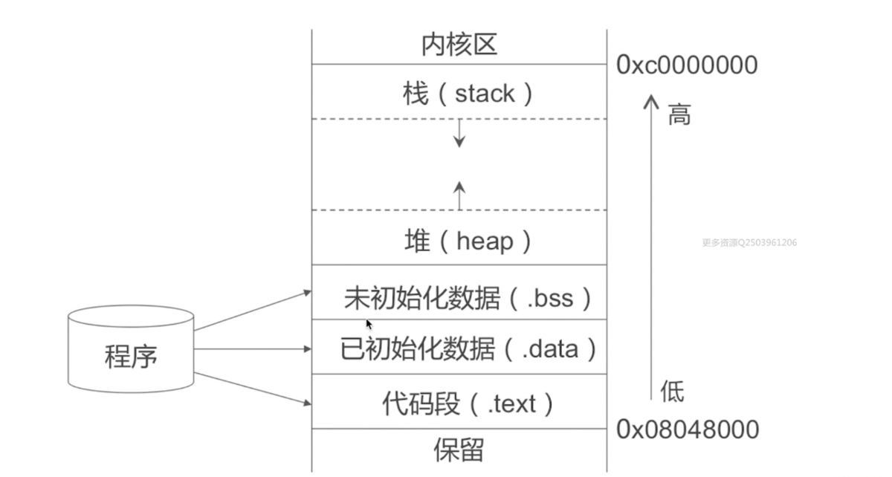
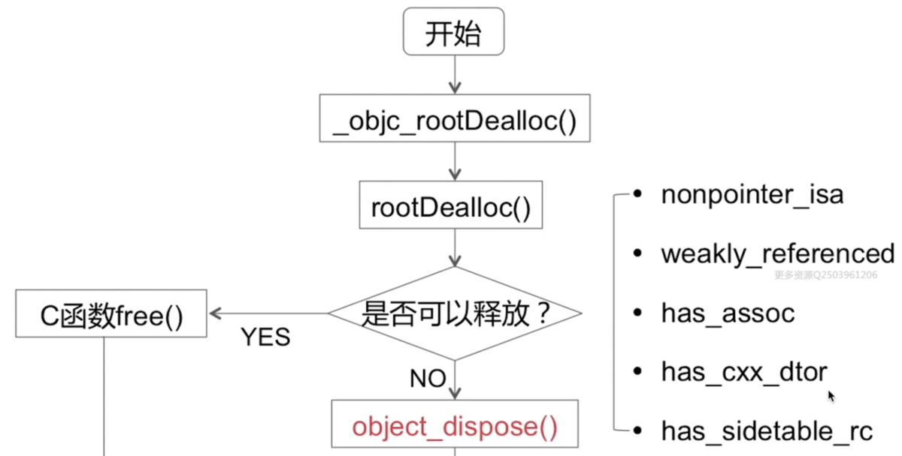
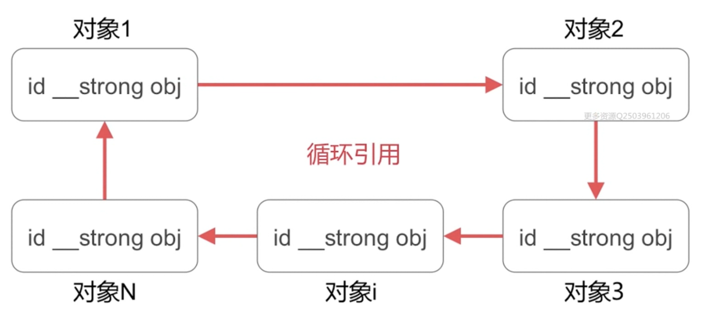

# 内存管理

- 内存布局
- 内存管理方案
- MRC（手动引用计数）和ARC（自动引用计数）
- 循环引用

#### 一、内存布局



- 栈（stack）:方法调用，局部变量等，是连续的，高地址往低地址扩展
- 堆（heap）:通过啊alloc等分配的对象，是离散的，低地址往高地址扩展，需要我们手动控制
- 未初始化数据（bss）:未初始化的全局变量等。
- 已初始化数据（data）:已初始化的全局变量等。
- 代码段（text）:程序代码。 

##### 2、64bit和32bit下long和char*所占字节是不同的

char：1字节（ASCII 2<sup>2</sup> = 256个字符）

char* (即指针变量)：4个字节（32位的寻址空间是2<sup>32</sup> ，即32个bit，也就是4个字节。同理64位编译器为8个字节）

short int：2个字节 范围 -2<sup>16</sup> ~ > 2<sup>16</sup> 即-32768 ~ > 32767

int：4个字节 范围 -2147483648 ~ > 2147483647

unsigned int：4个字节

long：4个字节范围和int一样64位下8个字节，范围-9223372036854775808 ~ 9223372036854775807

long long：8个字节 范围 -9223372036854775808 ~ 9223372036854775807

unsigned long long：8个字节 最大值：1844674407370955161

float：4个字节

double：8个字节

##### 3、static、const和sizeof关键字

##### static关键字

答：Static的用途主要有两个，一是用于修饰储存类型使之成为静态储存类型，二是用于修饰链接属性使之成为内部链接属性。

- 1、静态储存类型：

  在函数内定义的静态局部变量，该变量存在内存的静态区，所以即使该函数运行结束，静态变量的值不会被销毁，函数下次运行时能仍用到这个值。

  在函数外定义的静态变量------静态全局变量，该变量的作用域只能在定义该变量的文件中，不能被其他文件通过extern引用。

- 2、内部链接属性

  静态函数只能在声明它的源文件中使用

##### const关键字

- 1、声明常变量，使得指定的变量不能被修改，

  ```c
  const int a = 5; /* a的值一直为5，不能被改变 */
  const int b; b = 10; /* b的值被赋值为10后，不能被改变 */
  const int *ptr; /* ptr为指向整形常量的指针，ptr的值可以修改，但不能修改其所指向的值 */
  int *const ptr; /* ptr为指向整形的常量指针，ptr的值不能修改，但可以修改其所指向的值 */
  const int *const ptr; /* ptr为指向整形常量的常量指针，ptr及其指向的值都不能修改 */
  ```

- 2、修饰函数形参，使得形参在函数内不能被修改，表示输入参数。

  如：

  ```c
  int fun(const int a); 或 int fun(const char *str);
  ```

- 3、修饰函数返回值，使得函数的返回值不能被修改。

  ```c
  const char *getstr(void); 使用: const *str = getstr();
  const int getint(void); 使用: const int a = getint();
  ```

##### sizeof关键字

sizeof是在编译阶段处理，且不能被编译为机器码。sizeof的结果等于对象或类型所占的内存字节数。sizeof的返回值类型为size_t。

- 变量：int a; sizeof(a)为4;

- 指针：int *p; sizeof(p)为4;

- 数组：int b[10]; sizeof(b)为数组的大小，4*10; int c[0]; sizeof(c)等于0

- 结构体：struct (int a; char ch;)s1; sizeof(s1)为8 与结构体字节对齐有关。

  对结构体求sizeof时，有两个原则：

  ```
  (1) 展开后的结构体第一个成员的偏移量应当是被展开的结构体中最大的成员的整数倍。
  (2) 结构体大小必须是所有成员大小的整数倍，这里所有成员计算的是展开后的成员，而不是将嵌套的结构体当做一个整体
  ```

- 注意：不能对结构体中的位域成员使用sizeof

  sizeof(void)等于1

  sizeof(void *)等于4

#### 二、内存管理方案

- taggedPointer：储存小对象如NSNumber。深入理解tagged Pointer

- NONPOINTER_ISA（非指针型的isa）：在64位架构下，isa指针是占64bit的，实际上只有30多为就已经够用了，为了提高利用率，剩余的比特位储存了内存管理相关的数据内容。

- 离散表：复杂的数据结构，包括了引用计数表和弱引用表

  通过SideTables()机构来实现的，SideTables()结构下，有很多SideTables的数据结构。

  而SideTables当中包含了自旋锁，引用计数表，弱引用表。

  SideTables()实际上是一个哈希表，通过对象的地址来计算该对象的引用计数在哪个SideTables中。

  自旋锁：

- 自旋锁是“忙等”的锁

- 适用于轻量访问

  引用计数表和弱引用表实际是一个哈希表，来提高查找效率。

#### 三、MRC（手动引用计数）和ARC（自动引用计数）

1、MAC：alloc、retain、release、retainCount、autorelease、dealloc

2、ARC：

- ARC是LLVM和Runtime协作的结果
- ARC禁止手动调用retain、release、retainCount、autorelease关键字
- ARC新增weak、strong关键字

3、引用计数管理

- alloc：经过一系列函数调用，最终调用了calloc函数，这里并没有设置引用计数为1

- retain：经过两次哈希查找，找到其对应引用计数值，然后将引用计数加1（实际是加偏移量）

- release：和retain相反，经过两次哈希查找，找到其对应引用计数值，然后将引用计数减1

- dealloc：

  

4、弱引用管理：

- 添加weak变量：通过哈希算法位置查找添加。如果查找对应位置中已经有了当前对象所对应的弱引用数组，就把新的弱引用变量添加到数组当中；如果没有，就创建一个弱引用数组，并将该弱引用变量添加到该数组中。

- 当一个被weak修饰的对象被释放后，weak对象怎么处理的？

  清除weak变量，同时设置指向为nil。当对象被dealloc释放后，在dealloc的内部实现中，会调用弱引用清除的相关函数，会根据当前对象指针查找弱引用表，找到当前对象所对应的弱引用数组，将数组中的所有弱引用指针都置为nil。

5、自动释放池：

在当次runloop将要结束的时候调用objc_autoreleasePoolPop，并push进来一个新的AutoreleasePool

AutoreleasePoolPage是以栈为结点通过双向链表的形式组合而成，是和线程一一对应的。

内部属性有parent，child对应前后两个结点，thread对应线程，next指针指向栈中下一个可填充的位置。

- AutoreleasePool实现原理？

  编译器会将@autoreleaspool { } 写成为：

  ```objective-c
  void * ctx = objc_autoreleasePoolPush; 
      { }
  objc_autoreleasePoolPop(ctx);
  ```

- objc_autoreleasePoolPush：

  把当前next位置置为nil，即哨兵对象，然后next指针指向下一个可入栈位置，AutoreleasePool的多层嵌套，即每次objc_autoreleasePoolPush，实际上是不断地向栈中插入哨兵对象。

- objc_autoreleasePoolPop:

  根据传入的哨兵对象找到对应位置。

  给上次push操作之后添加的对象依次发送release消息。

  回退next指针到正确的位置。

#### 四、循环引用

循环引用的实质：多个对象相互之间有强引用，不能释放让系统回收。

如何解决循环引用？

1、避免产生循环引用，通常是将strong引用改为weak引用。

比如在修饰属性时用weak

在block内调用对象方法时，使用其弱引用，这里可以使用两个弘

```objective-c
#define WS(weakSelf)  __weak __typeof(&*self)weakSelf = self; // 弱引用
#define ST(strongSelf) __strong __typeof(&*self)strongSelf = weakSelf; //使用这个要先声明weakSelf
```

还可以使用_block来修饰变量

在MRC下，_block不会增加其引用计数，避免了循环引用

在ARC下，_block修饰对象会被强引用，无法避免循环引用，需要手动解除。

2、在合适时机去手动断开循环引用。

通常我们使用第一种。

##### 循环引用场景：

- 自循环引用

  对象强持有的属性同时持有该对象

- 相互循环引用

  

- 多循环引用

  

1. 代理（delegate）循环引用属于相互循环引用

   delegate是iOS中开发中比较常遇到的循环引用，一般在声明delegate的时候都要使用弱引用weak，或者assign，当然怎么选择使用assign还是weak，MRC的话只能用assign，在ACR的情况下最好使用weak，因为weak修饰的变量在释放后自动指向nil，防止野指针的存在

2. NSTimer循环引用属于相互循环使用

   在控制器内，创建NSTimer作为其属性，由于定时器创建后也会强引用该控制器对象，那么该对象和定时器就相互循环引用了。

   如何解决呢？

   这里我们可以使用手动断开循环引用：

   如果是不重复定时器，在回调方法里将定时器invalidate并置为nil即可。

   如果是重复定时器，在合适的位置将其invalidate并置为nil即可。

3. block循环引用

   如：

   ```objective-c
   @property (copy, nonatomic) dispatch_block_t myBlock;
   @property (copy, nonatomic) NSString *blockString;
   
   - (void)testBlock {
     self.myBlock = ^() {
       NSLog(@"%@",self.blockString)
     };
   }
   ```

   由于block会对block中的对象进行持有操作，就相当于持有了其中的对象，而如果此时block中的对象又持有了该block，则会造成循环引用。

   解决方案就是使用_weak修饰self即可

   ```objective-c
   __weak typeof(self) weakSelf = self;
   self.myBlock = ^() {
       NSLog(@"%@",self.blockString)
   }
   ```

   - 并不是所有block都会造成循环引用。

     只有被强引用了block才会产生循环引用

     而比如 dispatch_async(dispatch_get_main_queue(), ^{}), [UIView animateWithDuration: 1 animations: ^{ }]这些系统方法等

     或者block并不是其属性而是临时变量，即栈block

     ```objective-c
     [self testWithBlock: ^{
       NSLog(@"%@", self);
     }];
     
     - (void)testWithBlock:(dispatch_block_t)block {
       block();
     }
     ```

      还有一种场景，在block执行开始时self对象还未被释放，而执行过程中，self被释放了，由于是用weak修饰的，那么weakSelf也会被释放了，此时在block里访问weakSelf时，可能会发生错误（向nil对象发消息并不会崩溃，但也没有任何效果）。

     对于这种场景，应该在block中对 对象使用_strong修饰，使得在block期间对 对象持有，block执行结束后，解除其持有。

     ```objective-c
     __weak typeof(self) weakSelf = self;
     self.myBlock = ^() {
       __strong __typeof(self) strongSelf = weakSelf;
       [strongSelf test];
     };
     ```

     

