## Category

##### 面试题

1. Category的实现原理，以及Category为什么只能家方法不能加属性
2. Category中有load方法吗？load方法时什么时候调用的？load方法能继承吗？
3. load、initialize的区别，以及它们在categroy重写的时候调用的次序。

#### Category的本质

Category的 demo

```objective-c
Presen类
// Presen.h
#import<Foundation/Foundation.h>
@interface Preson : NSObject {
    int _age;
}
- (void)run;

@end
  
// Presen.m
#import "Preson.h"
@implementation Preson
- (void)run {
    NSLog(@"Person - run");
}
@end
  
  Presen扩展1
// Presen+Test.h
#import "Preson.h"
  
@interface Preson (Test) <NSCopying>
  
- (void)test;

+ (void)abc;

@property (assign, nonatomic) int age;

- (void)setAge:(int)age;

- (int)age;

@end
  
  // Presen+Test.m
#import "Preson+Test.h"
@implementation Preson (Test)
- (void)test {
}

+ (void)abc {
}
- (void)setAge:(int)age {
}
- (int)age {
    return 10;
}

@end
  
  Presen分类2
// Preson+Test2.h
#import "Preson.h"
@interface Preson (Test2)
@end

// Preson+Test2.m
#import "Preson+Test2.h"
@implementation Preson (Test2)
- (void)run {
    NSLog(@"Person (Test2) - run");
}
@end
  
 
```

实例对象的isa指针指向类对象，类对象的isa指针指向元类对象，当p调用run方法时，通过实例对象的isa指针找到类对象，然后在类对象中查找对象方法，如果没有找到，就通过类对象的superclass指针找到父类对象，接着去寻找run方法。

那么当调用分类的方法时，步骤是否和调用对象方法一样呢？

`分类中的对象方法依然是存在在类对象中，同本类对象方法在同一个地方，调用步骤也同调用对象方法一样。如果类对象方法的会，也同样是储存在元类对象中。`

那么分类方法时如何储存在类对象中的，通过源码看一下类的底层结构。

#### 分类的底层结构

通过查看分类的源码可以找到category_t结构体

```c
struct category_t {
  const char *name;
  classref_t cls;
  struct method_list_t *instanceMethods; // 对象方法
  struct method_list_t *classMethods; // 类方法
  struct protocol_list_t *protocols; // 协议
  struct property_list_t *instanceProperties; // 属性
  // Fields below this point are not always present on disk (此点以下的字段并不总是出现在磁盘上。)
  struct property_list_t *_classProperties;
  
  method_list_t *methodsForMeta(bool isMeta) {
    if (isMeta) return classMethods;
    else return instanceMethods;
  }
  
  property_list_t *propertiesForMeta(bool isMeta, struct header_info *hi);
}
```

从源码基本可以看出我们平时使用categroy的方式，对象方法，类方法，协议和属性都可以找到对应的储存方式。并且我们发现分类结构体重是不存在成员变量的，因此分类中是不允许添加成员变量的。分类中添加的属性并不会帮助我们自动生成成员变量，只会生成get set方法的声明，需要我们自己去实现。<strong><a href="属性和成员变量的区别.html">（属性和成员变量的区别）</a></strong>

通过源码我们发现，分类的方法，协议，属性等好像确实是存在categroy结构体里面的，那么它又是储存在类对象中的呢？

看一下底层的内部方法探寻其中的原理。

首先通过命令行将Preson+Test.m文件转换为c++文件，查看其中的编译过程。

```CQL
xcrun -sdk iphoneos clang -arch arm64 -rewrite-objc Preson+Test.m
```

在分类转化为c++文件中可以看出_categroy_t结构体中，存放着类名，对象方法列表，类方法列表，协议列表，以及属性列表。

```c++
struct _category_t {
  const char *name;
  struct _class_t *cls;
  const struct _method_list_t *instance_methods;
  const struct _method_list_t *class_methods;
  const struct _protocol_list_t *protocols;
  const struct _prop_list_t *properties;
}
```

紧接着，可以看到_method_list_t类型的结构体，如下

```c++
static struct /* _method_list_t */ {
  unsigned int entsize // sizeof(struct _objc_method)
  unsigned int method_count;
  struct _objc_method method_list[3];
} _OBJC_$CATEGORY_INSTANCE_METHODS_Preson_$_Test __attribute__ ((used, section ("__DATA,__objc_const"))) = {
  sizeof(_objc_method),
  3,
  {{(struct objc_selector *)"test", "v16@0:8", (void *)_I_Preson_Test_test},
  {(struct objc_selector *)"setAge:", "v20@0:8i16", (void *)_I_Preson_Test_setAge_},
  {(struct objc_selector *)"age", "i16@0:8", (void *)_I_Preson_Test_age}}
};
```

上图中我们发现这个结构体`_OBJC_$_CATEGORY_INSTANCE_METHODS_Preson_$_Test`从名称可以看出是INSTANCE_METHODS对象方法，并且一一对应为上面结构体内赋值。我们可以看到结构体中储存了方法占用的内存，方法数量，以及方法列表。并且从上图中找到分类中我们实现对应的对象方法，test，setAge，age三个方法

接下来我们发现同样的_method_list_t类型的类方法结构体，如下图所示

```c++
static struct /* _method_list_t */ {
  unsigned int entsize; // sizeof(struct _objc_method)
  unsigned int method_count;
  struct _objc_method method_list[1];
} _OBJC_$CATEGORY_CLASS_METHODS_Preson_$_Test __attribute__ ((used, section ("__DATA,__objc_const"))) = {
  sizeof(_objc_method),
  1,
  {{(struct objc_selector *)"abc", "v16@0:8", (void *)_C_Preson_Test_abc}}
};
```

同上面对象方法列表一样，这个我们可以看出是类方法列表结构体`_OBJC_$_CATEGORY_CLASS_METHODS_Preson_$_Test`,同对象方法结构相同，同样可以看到我们实例的类方法，abc。

接下来是协议方法列表

```c++
static const char *_OBJC_PROTOCOL_METHOD_TYPES_NSCopying [] __attribute__ ((used, section ("__DATA,__objc_const"))) = {
  "@24@0:8^{_NSZone=}16"
};
static struct /* _method_list_t */ {
  unsigned int entsize; // sizeof(struct _objc_method)
  unsigned int method_count;
  struct _objc_method method_list[1];
} _OBJC_PROTOCOL_INSTANCE_METHODS_NSCopying __attribute__ ((used, section ("__DATA,__objc_const"))) = {
  sizeof(_objc_method),
  1,
  {{(struct objc_selector *)"copyWithZone:", "@24@0:8^{_NSZone=}16", 0}}
};

struct _protocol_t _OBJC_PROTOCOL_NSCopying __attribute__ ((used)) = {
  0,
  "NSCopying",
  0,
  (const struct method_list_t *)&_OBJC_PROTOCOL_INSTANCE_METHODS_NSCopying,
  0,
  0,
  0,
  0,
  sizeof(_protocol_t),
  0,
  (const char **)&_OBJC_PROTOCOL_METHOD_TYPES_NSCopying
};
struct _protocol_t *_OBJC_LABEL_PROTOCOL_$_NSCopying = $_OBJC_PROTOCOL_NSCopying;

static struct /* _protocol_list_t */ {
  long protocol_count; // Note, this is 32/64 bit
  struct _protocol_t *super_protocols[1];
} _OBJC_CATEGORY_PROTOCOLS_$_Preson_$_Test __attribute__ ((used, section ("__DATA,__objc_const"))) = {
  1,
  &_OBJC_PROTOCOL_NSCopying
};
```

通过上述源码可以看到先将协议方法通过`_method_list_t`结构体储存，之后通过`_protocol_t`结构体储存在`_OBJC_CATEGORY_PROTOCOLS_$_Preson_$_Test`中通`_protocol_list_t`结构体一一对应，分别为protocol_count协议数量以及储存了协议方法的`_protocol_t`结构体。

最后看属性列表

```c++
static struct /* _prop_list_t */ {
  unsigned int entsize; // sizeof(struct _prop_t)
  unsigned int count_of_properties;
  struct _prop_t prop_list[1];
} _OBJC_$_PROP_LIST_Preson_$_Test __attribute__ ((used, section ("__DATA,__objc_const"))) = {
  sizeof(_prop_t),
  1,
  {{"age", "Ti,N"}}
};
```

属性列表结构体`OBJC_$_PROP_LIST_Preson_$_Test`同_prop_list_t结构体对应，储存属性的占用空间，属性数量，以及属性列表，从上图可以看到我们自己写的age属性。

最后可以看到定义了`_OBJC_$_CATEGORY_Preson_$_Test`结构体，并且即将我们上面着重分析的结构体一一赋值，通过两张图片对照一下。

_category_t

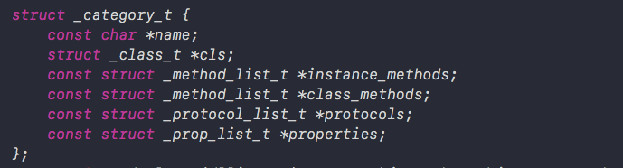

`_OBJC_$_CATEGORY_Preson_$_Test`

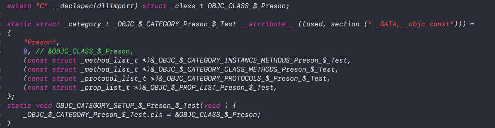

上下两张图一一对应 ，并且我们看到定义`_class_t`类型的`OBJC_CLASS_$_Preson`结构体，最后将`_OBJC_$_CATEGORY_Preson_$_Test`的`cls`指针指向`OBJC_CLASS_$_Preson`结构体地址。我们可以看出，`cls`指针指向的应该是分类的主类类对象的地址。

通过以上分析我们发现。分类源码中确实是将我们定义的对象方法，类方法，属性等都存放在catagory_t结构体中。接下来我们在回到runtime源码查看catagory_t储存的方法，属性，协议等是如何存储在类对象中的。

首先来看runtime初始化函数

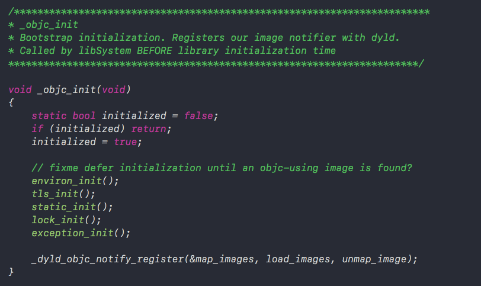

接着来看&map_images读取模块（images这里代表模块），来到map_images_nolock函数中找到`_read_images`函数，在`_read_images`函数中我们找到分类相关代码

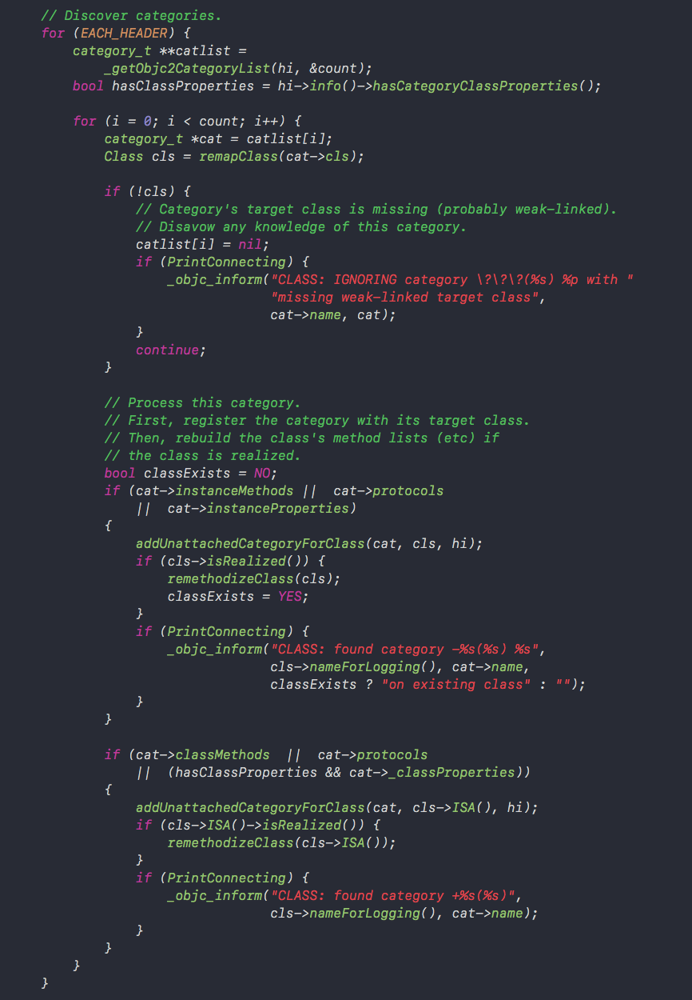

从上述代码中我们可以知道这段代码是用来查找有没有分类的。通过`_getObjc2CategoryList`函数获取到分类列表之后，进行遍历，获取其中的方法，协议，属性等。可以看到最终都调用了remethodizeClass(cls);函数。然后看一下remethodizeClass(cls);函数内部查看

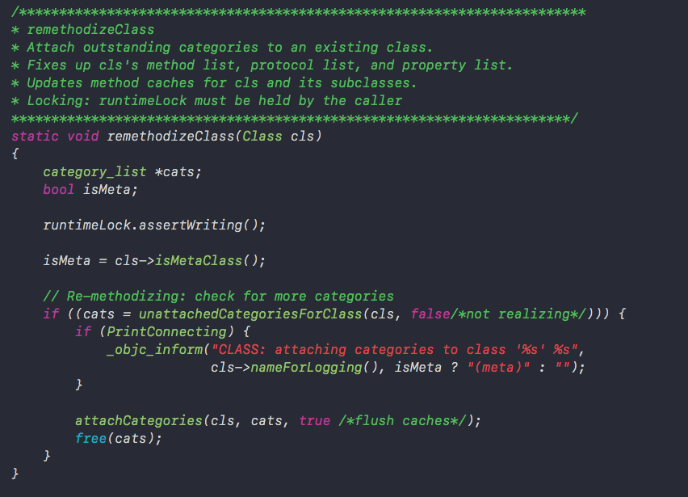

通过上述代码发现attachCategories函数接收了类对象cls和分类数组cats，如我们一开始写的代码所示，一个类可以有多个分类。之前说到分类信息储存在category_t结构体中，那么多个分类则保存在category_list中。

attachCategories函数内部

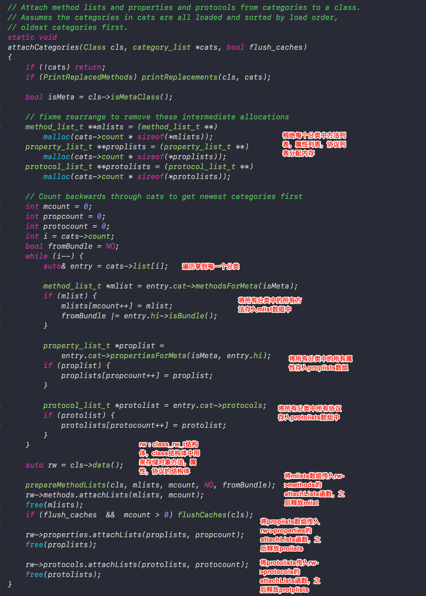

上述源码中可以看出，首先根据方法列表，属性列表，协议列表，malloc分配内存，根据多少个分类以及每一块方法需要多少内存来分配相应的内存地址。之后从分类数组里面往三个数组里面存放分类数组里面存放的分类方法，属性以及协议放入对应mlist、proplists、protolosts数组中，这三个数组放着所有分类的方法，属性和协议。

之后通过类对象的data()方法，拿到类对象的class_rw_t结构体rw，在class结构体介绍过，class_rw_t中存放这个类对象的方法，属性和协议等数据，rw结构体通过类对象的data方法获取，所以rw里面存放这类对象里面的数据。

之后分别通过rw调用方法列表、属性列表、协议列表的attachList函数，将所有的分类的方法、属性、协议列表数组传进去，大致可以猜想到在attachList方法内部将分类和本类相应的对象方法，属性，和协议进行了合并。

attachLists函数内部

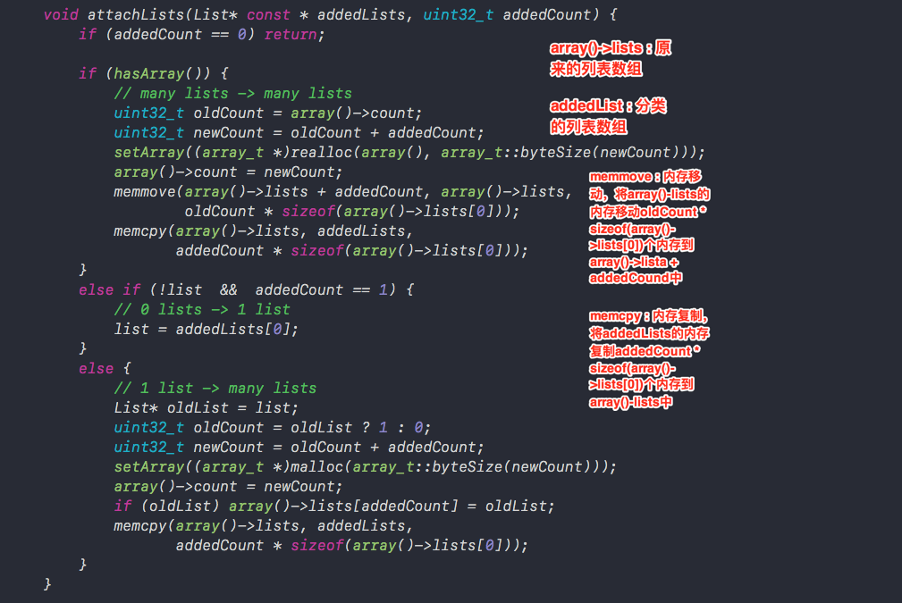

上述源代码中有两个重要的数组

array() -> lists: 类对象原来的方法列表、属性列表、协议列表。

addedLists：传入所有分类的方法列表、属性列表、协议列表。

attachLists函数中最重要的两个方法为memmove内存移动和memcpy内存拷贝。分别看一下这两个函数

```c++
// memmove：内存移动
// __dst：移动内存的目的地
// __src：被移动的内存首地址
// __len：被移动的内存长度
// 将__src的内存移动__len块内存到__dst中

void *memmove(void *__dst, const void *__src, size_t __len);

// memcpy：内存拷贝。
// __dst：拷贝内存的目的地
// __src：被拷贝的内存首地址
// __n：被移动的内存长度
// 将__src的内存移动__n块内存到__dst中

void *memcpy(void *__dst, const void *__src, size_t __n);

```

下面我们图示经过memmove和memcpy方法过后的内存变化。

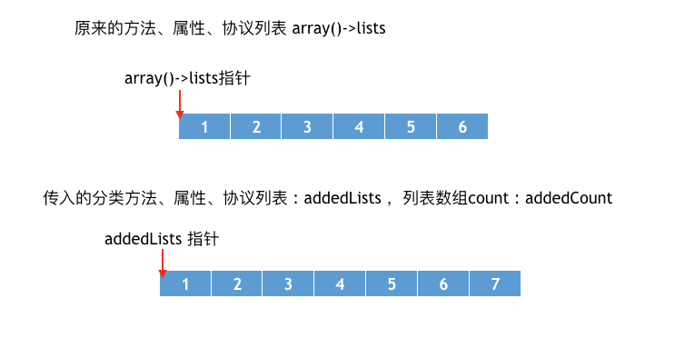

经过memmove方法之后，内存变化为

```c++
// array() -> lists 原来方法、属性、协议列表数组
// addedCount 分类数组长度
// oldCount * sizeof(array() -> lists[0]) 原来数组占据的空间
memmove(array() -> lists + addedCount, array() -> lists, oldCount * sizeof(array() -> lists[0]));
```

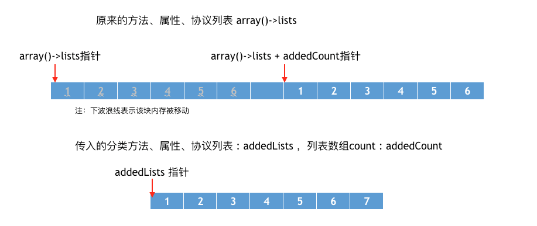

经过memmove方法之后，我们发现，虽然本类的方法、属性、协议列表会分别后移，但是本类的对应数组的指针依然指向原始位置。

memcpy方法之后，内存变化

```c++
// array() -> lists原来方法、属性、协议列表数组
// addedLists 分类方法、属性、协议列表数组
// addedCount * sizeof(array() -> lists[0]) 原来数组占据的空间
memcpy(array() -> lists, addedLists, addedCount * sizeof(array() -> lists[0]));
```

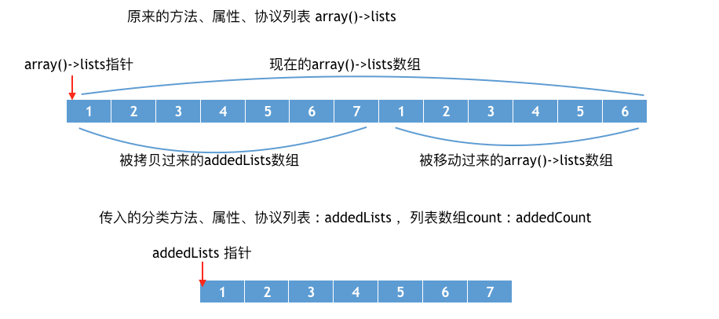

可以发现原来指针并没有改变，自始至终指向开头的位置。并且经过memmove和memcpy方法之后，分类的方法，属性、协议列表被放在了类对象中原本存储的方法，属性，协议列表前面。

那么为什么要将分类方法的列表追加到本来的对象方法前面呢，这样做的目的是为了保证分类方法优先调用，我们知道当分类重写本类的方法时，会覆盖本类的方法。

经过上面的分析我们知道本质上并不是覆盖，而是优先调用，本类的方法依然在内存中，我们可以通过打印所有类的所有方法名来查看

```objective-c
- (void)printMethodNamesOfClass:(Class)cls {
  unsigned int count;
  // 获得方法数组
  Method *methodList = class_copyMethodList(cls, &count);
  // 储存方法名
  NSMutableString *methodNames = [NSMutableString string];
  // 遍历所有的方法
  for (int i = 0; i < count; i++) {
    // 获得方法
    Method method = methodList[i];
    // 获得方法名
    NSString *methodName = NSStringFromSelector(method_getName(method));
    // 拼接方法名
    [methodNames appendString:methodName];
    [methodNames appendString:@","];
  }
  // 释放
  free(methodList);
  // 打印方法名
  NSLog(@"%@ - %@", cls, methodNames);
}

- (void)viewDidLoad {
  [super viewDidLoad];
  Preson *p = [[Preson alloc] init];
  [p run];
  [self printMethodNamesOfClass:[Preson class]];
}
```

通过下图中打印内存可以发现，调用的是Test2的run方法，并且Person类中存储着两个run方法。

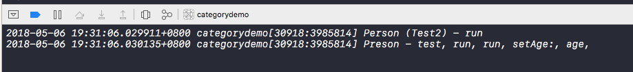

#### 总结

问：Category的实现原理，以及Category为什么只能加方法不能加属性？

答：分类的实现原理是将category中的方法，属性，协议数据放在category_t结构体中，然后将结构体内的方法列表拷贝到类对象的方法列表中。

Category可以添加属性，但是并不会自动生成成员变量及set/get方法。应该category_t结构中并不存在成员变量，通过之前对对象的分析我们知道成员变量是存放在实例对象中的，并且编译的那一刻就已经决定好了，而分类是在运行时才去加载的。那么我们就无法在程序运行时将分类的成员变量中添加到实例对象的结构体中。因此分类中不可以添加成员变量。

##### load和 initialize

load方法会在程序启动就会调用，当装载信息的时候就会调用.

调用顺序看一下源代码


通过源码我们发现是优先调用类的load方法，之后调用分类的load方法。

验证一下：

添加Student继承Presen类，并添加Student+Test分类，分别重写+load方法，其他什么都不做通过打印返现

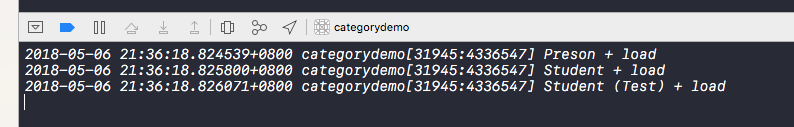

确实是优先调用类的load方法之后调用分类的load方法，不过调用类的load方法之前会保证其父类已经调用过load方法。

之后我们为Preson、Student、Student+Test 添加initialize方法。

我们知道当类第一次接受到消息时，就会调用initialize，相当于第一次使用类的时候就会调用initialize方法。调用子类的initialize方法了。当分类重写initialize方法时会先调用分类的方法。但是load方法并不会被覆盖，首先我们来看一下initialize的源码。

```c++
void callInitialize(Class cls) {
  ((void(*)(Class, SEL))objc_msgSend)(cls, SEL_initialize);
  asm("");
}
```

上源码发现，initialize是通过消息发送机制调用的，消息发送机制通过isa指针找到对应的方法与实现，因此先找到分类方法中的实现，会优先调用分类方法中的实现。

load方法调用的源码

```c++
static void call_class_loads(void) {
  int i;
  // Detach current loadable list.
  struct loadable_class *classes = loadable_classes;
  int used = loadable_classes_used;
  loadable_classes = nil;
  loadable_classes_allocated = 0;
  loadable_classes_used = 0;
  
  // Call all +loads for the detached list.
  for (i = 0; i < used; i++) {
    Class cls = classes[i].cls;
    load_method_t load_method = (load_method_t)classes[i].method;
    if (!cls) continue;
    
    if (PrintLoading) {
      _objc_inform("LOAD: +[%s load]\n", cls->nameForLogging());
    }
    (*load_method)(cls, SEL_load);
  }
  
  // Destroy the detached list
  if (classes) free(classes);
}
```

可以看到load方法中直接拿到load方法的内存地址直接调用方法，不在是通过消息发送机制调用。

```c++
// Call all +loads for the detached list.
for (i = 0; i < used; i++) {
  Category cat = cats[i].cat;
  load_method_t load_method = (load_method_t)cats[i].method;
  Class cls;
  if (!cat) continue;
  
  cls = _category_getClass(cat);
  if (cls && cls->isLoadable()) {
    if (PrintLoading) {
      _objc_inform("LOAD: +[%s(%s) load]\n", cls->nameForLogging(), _category_getName(cat));
    }
    (*load_method)(cls, SEL_load);
    cats[i].cat = nil;
  } 
}
```

可以看到分类中也是通过直接拿到load方法的地址进行调用。因此正如我们之前试验的一样，分类中重写load方法，并不会优先调用分类的load方法，而不调用本类中的load方法了。

总结

问：Category中有load方法吗？load方法是什么时候调用的？load方法能继承吗？

答：Category中有load方法，load方法在程序启动装载类信息的时候就会调用。load方法可以继承。调用子类的load方法之前，会先调用父类的load方法。

问：load、initialize的区别，以及他们在category重写的时候的调用次序。

答：区别在于调用方式和调用时刻

调用方式：load是根据函数地址直接调用，initialize是通过objc_msgSend调用

调用时刻：load是runtime加载类、分类的时候调用（只会调用1次），initialize是类第一次接收到消息的时候调用，每一个类只会initialize一次（父类的initialize方法可能会被调用多次）

调用顺序：先调用类的load方法，先编译那个类，就先调用load。在调用load之前会先调用父类的load方法。分类中load方法不会覆盖本类的load方法，先编译的分类优先调用load方法。

initialize先初始化父类，之后再初始化子类。如果子类没有实现+initialize，会调用父类的+initialize（所以父类的+initialize可能会被调用多次），如果分类实现了+initalize，就覆盖类本身的+initialize调用。


