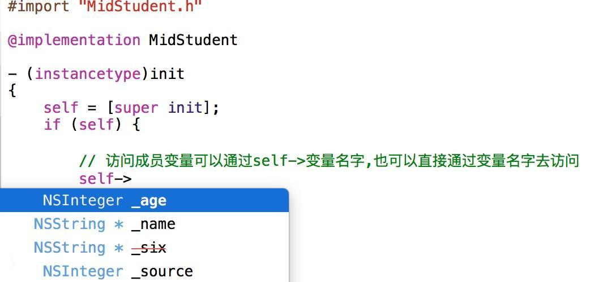
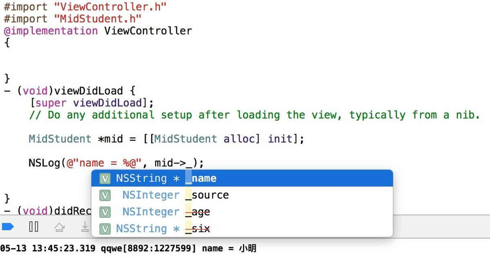
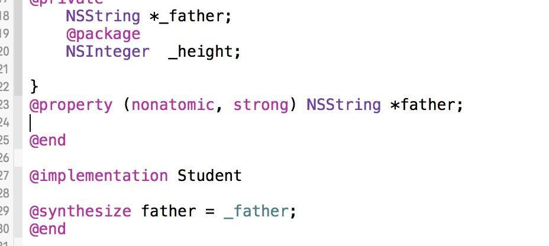
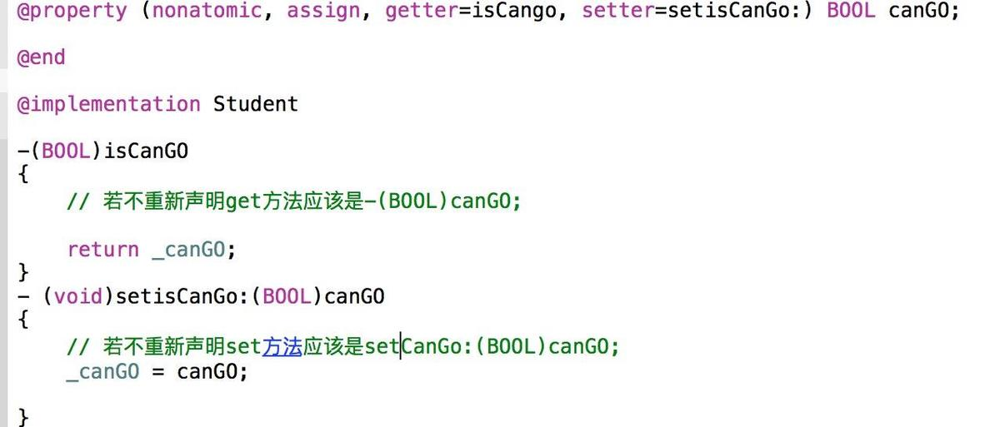

## 属性和成员变量的区别

#### 一. 成员变量

1. 成员变量的作用范围：

   @public：在任何地方都能直接访问对象的成员变量

   @private：只能在当前类的对象方法中直接访问，如果子类要访问需要调用父类的get/set方法

   @protected：可以在当前类及其子类对象方法中直接访问（系统默认下是它来修饰的）

   @package：在同一个包下就可以直接访问，比如说在同一个框架

2. 注意：

   无论父类是在@interface还是@implementation声明的成员变量子类都能拥有；但是子类能不能直接通过变量名来访问父类中定义的成员变量是需要看父类中定义的成员变量是由什么修饰符来修饰的。

3. 默认：

   在.m中成员变量的修饰符为@private.

   在.h中成员变量的修饰符为@protected.

   例：

   ```objective-c
   #import "Student.h"
   @implementation Student {
     @public
       NSString *friend;
     @protected
       NSString *mother;
     @private
       NSString *father;
     @package
       NSInteger height;
   }
   
   #import <Foundation/Foundation.h>
   @interface Student: NSObject {
     @public
       NSString *_name;
     @private
       NSString *_six;
     @protected
       NSInteger _age;
     @package
       NSInteger _source;
   }
   
   // 创建一个学生类，然后分别在.h和.m中声明4中不同的类型的变量，创建一个MidStudent来继承Student
   
   ```

   - 在MidStudent中来调用下看看这些变量哪些可以访问哪些不可以

   

   由图可以看出，我们在.m声明的变量子类是无法访问的（即使给他@public）也会被认为是@private，所以我们的对外属性都会放在.h去声明，然而由于six变量是@private，所以子类还是无法访问的。

   - 在去外部调用下MidStudent对象

   

   由于没有在Student或他的子类里面，所以只能访问.h中@public修饰的变量，也就是name，由于age是@protrcted在外部是不能被访问的。

   

   ####  二. 属性

   - 关于@synthesize object = _object 的解释
     我们可能见过很多地方都有这样的代码:

   

   1. @property的作用是定义属性，声明getter,setter方法。(注意：属性不是变量) 
   2. @synthesize的作用是实现属性的,如getter，setter方法
   3. 总结：一定要分清属性和变量的区别，不能混淆。@synthesize 声明的属性=变量。意思是，将属性的setter,getter方法，作用于这个变量。
   4. 但Xocde4.5以后,编译器会为你自动实现setter及getter方法,如果他找不到_father,会为你自动创建一个_father的变量

   - 声明属性的时候会有一些关键词这里简单说下他们的含义:

   ###### atomic: 原子性

   > 在objective-c 属性设置里面 默认的就是atomic ，意思就是 setter /getter函数是一个原子操作，如果多线程同时调用setter时，不会出现某一个线程执行完setter所有语句之前，另一个线程就开始执行setter，相当于 函数头尾加了锁 . 这样的话 并发访问性能会比较低

   

   ###### nonatomic: 非原子性

   > 非原子操作 一般不需要多线程支持的时候就用它，这样在 并发访问的时候效率会比较高 . 在objective-c里面通常对象类型都应该声明为非原子性的. iOS中程序启动的时候系统只会自动生成一个单一的主线程.程序在执行的时候一般情况下是在同一个线程里面对一个属性进行操作.

   

   ###### getter=getterName

   > 指定 get 方法，并需要实现这个方法 。必须返回与声明类型相同的变量，没有参数.相当于重新命名getter方法

   

   ###### setter=setterName:

   > 指定 set 方法，并需要实现这个方法 。带一个与声明类型相同的参数，没有返回值（返回空值）

   

   当声明为 readonly 的时候，不能指定 set 方法

   

   

   ###### readwirte

   > 如果没有声明成 readonly ，那就 默认是 readwrite 。可以用来赋值，执行set方法

   

   ###### readonly

   > 不可以被赋值

   

   ###### assgin

   > 通常用于标量（简单变量 int ， float ， CGRect 等）
   > 一种典型情况是用在对对象没有所有权的时候，通常是 delegate ，避免造成死循环（如果用 retain 的话会死循环）

   

   ###### strong

   > 释放旧对象 将旧对象的值赋予输入对象 ，再提高输入对象的索引计数为 1 ，常使用在继承自 NSObject 的类。(MRC为retain)

   

   ###### weak

   > weak 不增加对对象的引用计数，也不持有对象，因此不能决定对象的释放。它比 assign 多了一个功能，当对象消失后自动把指针变成 nil

   

   ###### copy

   > 建立一个索引计数为 1 的对象 然后释放旧对象 对 NSString 它指出 ，在赋值时使用传入值的一份拷贝 ，拷贝工作由 copy 方法执行，此属性只对那些实行了 NSCopying 协议的对象类型有效。

   

   