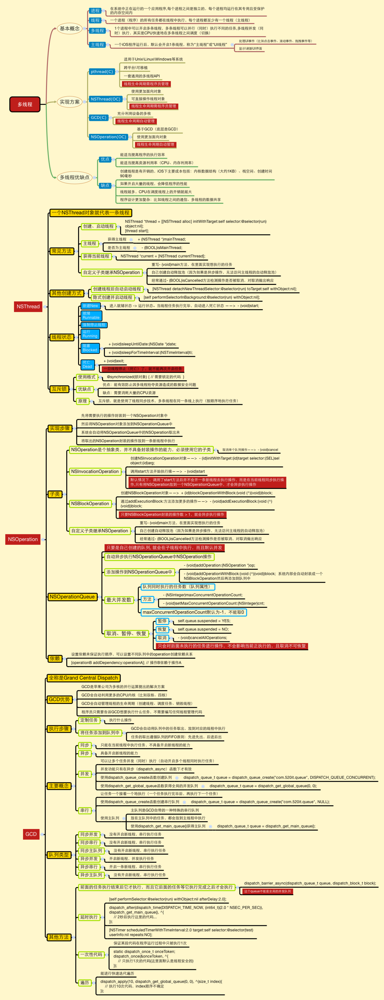

 ## 多线程

- 进程
- 线程
- 进程和线程的关系
- 多进程
- 多线程
- 任务
- 队列
- iOS中的多线程

### 一、进程：

1. 进程是一个具有一定独立功能的程序关于某次数据集合的一次运动活动，它是操作系统分配资源的基本单位。
2. 进程是指在系统中正在运行的一个应用程序，就是一段程序的执行过程，我们可以理解为手机上的一个app
3. 每个进程之间是独立的，每个进程均运行在其专用且受保护的内存空间内，拥有独立运行所需的全部资源。

### 二、线程

1. 程序执行流的最小单元，线程是进程中的一个实体。
2. 一个进程要想执行任务，必须至少有一条线程，应用程序启动的时候，系统会默认开启一条线程，也就是主线程。

### 三、进程和线程的关系

1. 线程是进程的执行单元，进程的所有任务都在线程中执行
2. 线程是CPU分配资源和调度的最小单位
3. 一个程序可以对应多个进程（多进程），一个进程中可有多个线程，但至少要有一条线程
4. 同一个进程内的线程共享资源。

### 四、多进程

打开mac的活动监视器，可以看到很多个进程同时运行


- 进程是程序在计算机上的一次执行活动。当你运行一个程序，你就启动了一个进程。显然，程序是死的（静态的），进程是活的（动态的）。
- 进程可以分为系统进程和用户进程。凡是用于完成操作系统的各种功能的进程就是系统进程，它们就是处于运行状态下的操作系统本身；所有由用户启动的进程都是用户进程。进程是操作系统进行资源分配的单位。
- 进程又被细化为线程，也就是一个进程下有多个能独立运行的更小单位，在通一个时间里，同一个计算机系统中如果允许两个或多个以上的进程处于运行状态，这便是多进程。

### 五、多线程

1. 同一时间，CPU只能处理1条线程，只有1条线程在执行。多线程并发执行，其实是CPU快速地在多条线程之间调度（切换）。如果CPU调度线程的时间足够快，就造成了多线程并发执行的假象。

2. 如果线程非常非常多，CPU会在N多线程之间调度，消耗大量的CPU资源，每条线程被调度执行的频次会降低（线程的执行效率会降低）

3. 多线程的优点：

   能适当提高程序的执行效率

   能适当提高资源利用率（CPU、内存利用率）

4. 多线程的缺点：

   开启线程需要占用一定的内存空间（默认情况下，主线程占用1M，子线程占用512KB），如果开启大量的线程，会占用大量的内存空间，降低程序的性能

   线程越多，CPU在调度线程上的开销就越大

   程序设计更加复杂：比如线程之间的通信、多线程的数据共享。

### 六、任务

就是执行操作的意思，也就是在线程中执行的那段代码，在GCD中是放在block中的。执行任务有两种方式：同步执行（sync）和异步执行（async）

- 同步（Sync）：同步添加任务到指定的队列中，在添加的任务执行结束之前，会一直等待，直到队列里面的任务完成之后在继续执行，即会阻塞线程。只能在当前线程中执行任务（是当前线程，不一定是主线程），不具备开启新线程的能力。
- 异步（Async）：线程会立即返回，无需等待就会继续执行下面的任务，不阻塞当前线程。可以在新线程中执行任务，具备开启新线程的能力（并不一定开启新线程）。如果不是添加到主队列上，异步会在子线程中执行任务

### 七、队列

队列（Dispatch Queue）：这里的队列指执行任务的等待队列，即用来存放任务的队列。队列是一种特殊的线性表，采用FIFO（先进先出）的原则，即新任务总是被插入到队列的末尾，而读取任务的时候总会从队列的头部开始读取。没读取一个任务，则从队列中释放一个任务

在GCD中有两种队列：串行队列和并发队列。两者都符合FIFO（先进先出）的原则。两者的主要区别是：执行顺序不同，以及开启线程数不同。

- 串行队列（Serial Dispatch Queue）：

  同一时间内，队列中只能执行一个任务，只有当前的任务执行完成之后，才能执行下一个任务。（只开启一个线程，一个任务执行完毕后，再执行下一个任务）。主队列是主线程上的一个串行队列，是系统自动为我们创建的。

- 并发队列（Concurrent Dispatch Queue）:

  同时允许多个任务并发执行。（可以开启多个线程，并且同时执行任务）。并发队列的并发功能只有在异步（dispatch_async）函数下才有效

  

### 八、iOS中的多线程

主要有三种：NSThread、NSoperationQueue、GCD

1. NSThread：轻量级别的多线程计数

   是我们自己手动开辟的子线程，如果使用的是初始化方式就需要我们自己启动，如果使用的是构造器方式它就会自动启动。只要是我们手动开辟的线程，都需要我们自己管理该线程，不只是启动，还有该线程使用完毕后的资源回收。

   ```objective-c
   NSThread *thread = [[NSThread alloc] initWithTarget:self selector:@selector(testThread:) object:@"我是参数"];
   // 当使用初始化方法出来的主线程需要start启动
   [thread start];
   // 可以为开辟的子线程起名字
   thread.name = @"NSThread线程";
   // 调整Thread的权限 线程权限的范围为0 ~ 1，越大权限越高，先执行的概率就会越高，由于是概率，所以并不能很准确的实现我们想要的执行顺序，默认值是0.5
   thread.threadPriority = 1;
   // 取消当前已启动的线程
   [thread cancel];
   // 通过遍历构造器开辟子线程
   [NSThread datachNewThreadSelector:@selector(testThread:) toTarget:self withObject:@"构造器方法"]
   ```

   - performSelector... 只要是NSObject的子类或者对象都可以通过调用方法进入子线程和主线程，其实这些方法所开辟的子线程也是NSThread的另一种体现方式。

     在编译阶段并不会去检查方法是否有效存在，如果不存在只会给出警告

     ```objective-c
     // 在当前线程。延迟1s执行。响应了OC语言的动态性，延迟到行时才绑定方法
     [self performSelector:@selector(aaa) withObject:nil afterDelay:1];
     // 回到主线程。waitUntilDone: 是否将该回调方法执行完在执行后面的代码，如果YES：就必须等回调方法执行完成之后才能执行后面的代码，说白了就是阻塞当前的线程；如果是NO：就是不等回到方法结束，不会阻塞当前线程
     [self performSelectorOnMainThread:@selector(aaa) withObject:nil withUntilDone:YES];
     // 开辟子线程
     [self performSelectorInBackground:@selector(aaa) withObject:nil];
     // 在指定线程执行
     [self performSelector:@selector(aaa) onThread:[NSThread currentThread] withObject:nil waitUntilDone:YES];
     ```

     需要注意的是：如果是带afterDelay的延时函数，会在内部创建一个NSTimer，然后添加到当前线程的Runloop中。也就是如果当前线程没有开启runloop，该方法会失效。在子线程中，需要启动runloop（注意调用顺序）

     ```objc
     [self performSelector:@selector(aaa) withObject:nil afterDelay:1];
     [[NSRunLoop currentRunloop] run];
     ```

     而performSelector:withObject:只是一个单纯的消息发送，和时间没有一点关系。所以不需要添加到子线程的RunLoop中也能执行

2. GCD对比NSOprationQueue

    我们要明确NSOprationQueue与GCD之间的关系

   GCD是面向底层的C语言的API，NSOprationQueue用GCD构建封装的，是GCD的高级抽象。

   1. GCD执行效率更高，而且由于队列中执行的是由block构成的任务，这是一个轻量级的数据结构，写起来更方便。
   2. GCD只支持FIFO的队列，而NSOprationQueue可以通过设置最大并发数，设置优先级，添加依赖关系等调整执行顺序
   3. NSOprationQueue甚至可以跨队列设置依赖关系，但是GCD只能通过设置串行队列，或者在队列内添加barrier(dispath_barrier_async)任务，才能控制执行顺序，较为复杂
   4. NSOprationQueue因为面向对象，所以支持KVO，可以监测operation是否正在执行（isExecuted）、是否结束（isFinished）、是否取消（isCanceld）

   - 实际项目开发中，很多时候只是会用到异步操作，不会有特别复杂的线程关系管理，所以苹果推崇的且优化完善、运行快速的GCD是首选

   - 如果考虑异步操作之间的事务性、顺序性、依赖关系，比如多线程并发下载，GCD需要自己写更多的代码来实现，而NSOprationQueue已经内建了这些支持。

   - 不论是GCD还是NSOprationQueue，我们接触的都是任务和队列，都没有直接接触到线程，事实上线程管理也的确不需要我们操心，系统对于线程的创建，调度管理和释放都做的很好。

     而NSThread需要我们自己去管理线程的生命周期，还要考虑线程同步、加锁问题，造成一些性能上的开销

     


## GCD

- GCD—同步/异步，串行/并发
- 死锁
- GCD任务执行顺序
- dispatch_barrier_async
- dispatch_group_async
- Dispatch Semaphore
- 延迟函数（dispatch_after）
- 使用dispatch_once实现单例

### 一、CGD — 队列

iOS中，有GCD、NSOperation、NSthread等几种多线程技术方案。

而GCD共有三种队列类型：

main queue：通过dispatch_get_main_queue()获得，这是一个与主线程相关的串行队列。

global queue：全局队列是并发队列，由整个进程共享。存在着高、中、低三种优先级的全局队列。调用dispatch_get_global_queue并传入优先级来访问队列。

自定义队列：通过函数dispatch_queue_create创建的队列。

### 二、死锁

死锁就是队列引起的循环等待

##### 1、一个比较常见的死锁例子：主队列同步

```objective-c
- (void)viewDidLoad {
  [super viewDidLoad];
  
  dispatch_sync(dispatch_get_main_queue(), ^{
    NSLog(@"dealloc");
  });
}
```

在主线程中运用主队列同步，也就是把任务放到了主线程的队列中。

同步对于任务是立刻执行的，那么当把任务放进主队列时，它就会立马执行，只有执行完这个任务，viewDidLoad才会继续向下执行。

而viewDidLoad和任务都是在主队列上的，由于队列的先进先出原则，任务又需要等待viewDidLoad执行完毕后才能继续执行，viewDidLoad和这个任务就形成的了相互循环等待，就造成了死锁。想避免这种死锁，可以将同步改成异步dispatch_async，或者将dispatch_get_main_queue换成其他串行或并行队列，都可以解决。

##### 2、同样，下边的代码也会造成死锁

```objective-c
dispatch_queue_t serialQueue = dispatch_queue_create("test", DISPATCH_QUEUE_SERIAL);
dispatch_async(serialQueue, ^{
  dispatch_sync(serialQueue, ^ {
    NSLog(@"deadlock")
  });
});
```

外面的函数无论是同步还是异步都会造成死锁。

这是因为里面的任务和外面的任务都在同一个serialQueue队列内，又是同步，这就和上边主队列同步的例子一样造成了死锁

解决方法也是和上边一样，将里面的同步改成异步dispatch_async,或者将serialQueue换成其他串行或并行队列，都可以解决

```objective-c
dispatch_queue_t serialQueue = dispatch_queue_create("test", DISPATCH_QUEUE_SERIAL);
disptach_quete_t serialQueue2 = dispatch_queue_create("test", DISPATCH_QUEUE_SERIAL);

dispatch_async(serialQueue, ^{
    dispatch_sync(serialQueue2, ^ {
    NSLog(@"deadlock")
  });
});
```

这样是不会死锁的，并且serialQueue和serialQueue2是在同一个线程中的。

### 三、CGD任务执行顺序

##### 1、串行队列先异步后同步

```objective-c
    dispatch_queue_t serialQueue = dispatch_queue_create("test", DISPATCH_QUEUE_SERIAL);
    
    NSLog(@"1");
    
    dispatch_async(serialQueue, ^{
        NSLog(@"2");
    });
    
    NSLog(@"3");
    
    dispatch_sync(serialQueue, ^{
        NSLog(@"4");
    });
    
    NSLog(@"5");
```

打印顺序是13245

原因是：

首先先打印1

接下来将任务2添加至串行队列想，由于任务2是异步，不会阻塞线程，继续向下执行，打印3然后是任务4，将任务4添加至串行队列上，因为任务4和任务2在同一串行队列，根据队列先进先出原则，任务4必须等任务2执行完后才能执行，又因为任务4是同步任务，会阻塞线程，只有执行完任务4才能继续向下执行打印5

所以最终顺序就是13245

这里的任务4在主线程中执行，而任务2在子线程中执行，

如果任务4是添加到另一个串行队列或并行对，则任务2和任务4无序执行（可以添加多个任务看效果）

##### 2、perfprmSeletor

```objective-c
dispatch_async(dispatch_get_global_queue(0, 0), ^{
  [self performSelector:@selector(test:) withObject: nil afterDelay: 0];
});
```

这里的test方法是不会去执行的，原因在于

```objective-c
- (void)performSelector:(SEL)aSelector withObject:(id)anArgument afterDelay:(NSTimeInterval)delay;
```

这个方法要创建提交任务到runloop上的，而GCD底层创建的线程是默认没有开启对应的runloop的，所以这个方法就会失效。

而如果将dispatch_get_global_queue改成主队列，由于主队列所在的主线程默认开启了runloop的，就会去执行（将dispatch_async改成同步，因为同步是在当前线程执行，那么如果当前线程是主线程，test方法也是会去执行的）。

### 四、dispatch_barrier_async

##### 1、问：怎么用GCD实现多读单写？

多读单写的意思就是：可以多个读者同时读取数据，而在读的时候，不能去写数组。并且，在写的过程中，不能有其他写者去写。即读者之间是并发的，写者与读者或其他写者是互斥的。


这里的写处理就是通过栅栏的形式去写。

就可以用dispatch_barrier_sync(栅栏函数)去实现

##### 2、diaspatch_barrier_sync的用法：

```objective-c
    dispatch_queue_t concurrentQueue = dispatch_queue_create("test", DISPATCH_QUEUE_CONCURRENT);
    
    for (NSInteger i = 0; i < 10; i ++) {
        dispatch_sync(concurrentQueue, ^{
            NSLog(@"%zd", i);
        });
    }
    
    dispatch_barrier_sync(concurrentQueue, ^{
        NSLog(@"barrier");
    });
    
    for (NSInteger i = 10; i < 20; i ++) {
        dispatch_sync(concurrentQueue, ^{
            NSLog(@"%zd", i);
        });
    }
```

这里的dispatch_barrier_sync上的队列要和需要阻塞的任务在同一队列上，否则是无效的。

从打印上看，任务0-9和任务10-19因为是异步并发的原因，彼此是无序的。而由于栅栏函数的存在，导致顺序必然是先执行任务0-9，在执行栅栏函数，再去执行任务10-19.

- dispatch_barrier_sync: 提交一个栅栏函数在执行中，它会等待栅栏函数执行完。

- dispatch_barrier_async:提交一个栅栏函数在异步执行中，它会立马返回。

  而dispatch_barrier_sync和dispatch_barrier_async的区别也就在于会不会阻塞当前线程，比如上述代码如果在dispatch_barrier_async后随便加一条打印，则会先去执行该打印，再去执行任务0-9和栅栏函数；而如果是dispatch_barrier_sync，则会在任务0-9和栅栏函数后去执行这条打印。

##### 3、则可以这样设计多读单写：

```objective-c
- (id)readDataForKey:(NSString *)key {
    __block id result;
    
    dispatch_sync(_concurrentQueue, ^{
        result = [self valueForKey:key];
    });
    
    return result;
}

- (void)writeData:(id)data forKey:(NSString *)key {
    dispatch_barrier_async(_concurrentQueue, ^{
        [self setValue:data forKey:key];
    });
}

```

### 五、dispatch_group_async

场景：在n个耗时并发人去都完成后，在去执行接下来的任务，比如,在n个网络请求完成后去刷新UI页面。

```objective-c
    dispatch_queue_t councurrentQueue = dispatch_queue_create("test", DISPATCH_QUEUE_CONCURRENT);
    
    dispatch_group_t group = dispatch_group_create();
    
    for (NSInteger i = 0; i < 10; i ++) {
        dispatch_group_async(group, councurrentQueue, ^{
            sleep(1);
            NSLog(@"%zd:网络请求",i);
        });
    }
    
    dispatch_group_notify(group, dispatch_get_main_queue(), ^{
        NSLog(@"刷新页面");
    });
```

<strong><a href="dispatch_group.html">深入理解GCD之dispatch_group</a></strong>

### 六、Dispatch Semaphore

GCD 中的信号量是指Dispatch Semaphore，是持有计数的信号。

Dispatch Semaphore 提供了三个函数

1. dispatch_semaphore_create：创建一个Semaphore并初始化信号的总量

2. dispatch_semaphore_signal：发送一个信号，让信号总量加1

3. dispatch_semaphore_wait：可以使总信号量减1，当信号量为0是就会一直等待（阻塞所在线程），否则就可以正常执行。

   Dispatch Semaphore 在实际开发中主要用于：

   - 保持线程同步，将一部执行任务转换为同步执行任务
   - 保证线程安全，为线程加锁

   1、保持线程同步：

   ```objective-c
       dispatch_semaphore_t semaphore = dispatch_semaphore_create(0);
       __block NSInteger number = 0;
       dispatch_async(dispatch_get_global_queue(DISPATCH_QUEUE_PRIORITY_DEFAULT, 0), ^{
           number = 100;
           dispatch_semaphore_signal(semaphore);
       });
       
       dispatch_semaphore_wait(semaphore, DISPATCH_TIME_FOREVER);
       
       NSLog(@"semaphore---end, number = %zd.,", number);
   ```

   dispatch_semaphore_wait加锁阻塞了当前线程，dispatch_semaphore_signal解锁首先创建全局变量

   ```
   _semapgore = dispatch_semaphore_create(1);
   ```

   注意到这里的初始化信号量是1.

   ```objective-c
   - (void)asyncTask {
       dispatch_semaphore_wait(_semaphore, DISPATCH_TIME_FOREVER);
       
       count ++;
       
       sleep(1);
       
       NSLog(@"执行任务：%zd",count);
       
       dispatch_semaphore_signal(_semaphore)
   }
   ```

   异步并发调用asyncTask

   ```objective-c
       for (NSInteger i = 0;i < 100 ; i ++) {
           dispatch_async(dispatch_get_global_queue(0, 0), ^{
               [self asyncTask];
           });
       }
   ```

   然后发现打印是从任务1顺序执行到100，没有发生两个任务同时执行的情况。

   原因如下：

   在子线程中并发执行asyncTask，那么第一个添加到并发队里的，会将信号量减1，此时信号量等于0，可以执行接下来的任务。而并发队列中其他任务，由于此时信号量不等于0，必须等当前正在执行的任务执行完毕后调用dispatch_semaphore_signal将信号量加1，才能继续执行接下来的任务，以此类推，从而达到线程加锁的目的。

### 七、延时函数（dispatch_after）

dispatch_after能让我们添加进队列的任务延时执行，该函数并不是在指定时间后执行处理，而只是在指定时间追加处理到disptach_queue

```objective-c
// 第一个参数time, 第二个参数是dispatch_queue, 第三个参数是要执行的block
    dispatch_after(dispatch_time(DISPATCH_TIME_NOW, (int64_t)(2 * NSEC_PER_SEC)), dispatch_get_main_queue(), ^{
        NSLog(@"dispatch_after");
    });
```

由于其内部使用的是dispatch_time_t管理的时间，而不是NSTimer.

所以如果在子线程中调用，相比performSelector:afterDelay,不用关心runloop是否开启。

### 八、使用dispatch_once实现单利

```objective-c
+ (instancetype)shareInstance {
    static dispatch_once_t onceToken;
    
    static id instance = nil;
        
    dispatch_once(&onceToken, ^{
        instance = [[self alloc]init];
    });
    
    return instance;
}

```

